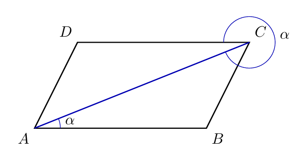
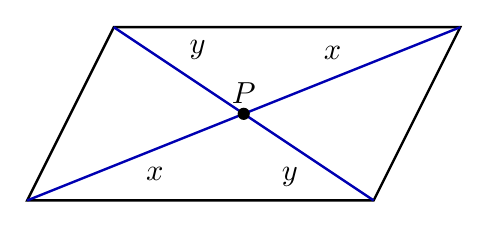
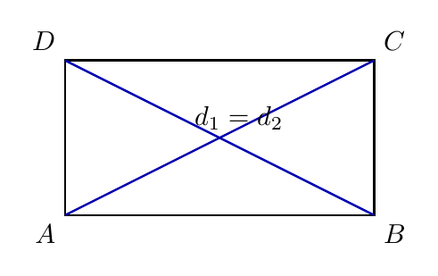
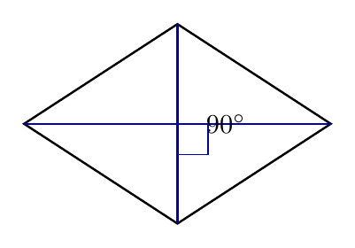
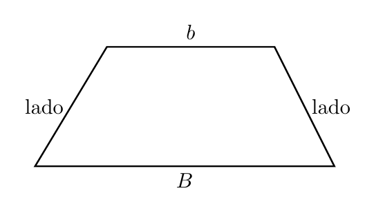
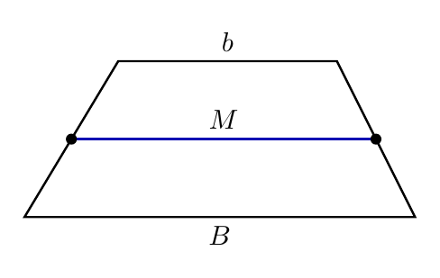

# Capítulo 2 — Paralelogramos e Trapézios

## O que continua igual quando a figura inclina?

Uma porta vista em perspectiva pode parecer inclinada, mas ainda conserva relações estruturais. Em um paralelogramo, as propriedades não são coincidências visuais. Elas são consequências da definição: dois pares de lados opostos paralelos.

> 💭 **Pense um pouco:**  
> O centro de um retângulo é coincidência visual ou consequência geométrica?

## 1. Paralelogramos: Propriedades que Nascem da Definição

Um paralelogramo é um quadrilátero com 2 pares de lados opostos paralelos.

### 1.1 Lados e ângulos opostos

Considere um paralelogramo $$ABCD$$, com:

$$\overline{AB} \parallel \overline{CD}$$

$$\overline{AD} \parallel \overline{BC}$$

Trace a diagonal $$\overline{AC}$$. Ela divide o paralelogramo em dois triângulos: $$\triangle ABC$$ e $$\triangle CDA$$.

Ideia da demonstração:

- hipótese: lados opostos paralelos;
- construção auxiliar: diagonal $$\overline{AC}$$;
- ângulos alternos internos: aparecem porque há paralelas cortadas por uma transversal;
- lado comum: os dois triângulos compartilham $$\overline{AC}$$;
- conclusão: os triângulos têm correspondências que permitem deduzir propriedades do paralelogramo.

Como resultado, em todo paralelogramo:

$$\overline{AB} = \overline{CD}$$

$$\overline{BC} = \overline{AD}$$

Também vale:

$$\hat{A} = \hat{C}$$

$$\hat{B} = \hat{D}$$

Ângulos consecutivos são suplementares, pois estão do mesmo lado de uma transversal entre retas paralelas:

$$\hat{A} + \hat{B} = 180^{\circ}$$

$$\hat{B} + \hat{C} = 180^{\circ}$$

**Exemplo**

Em um paralelogramo, $$\hat{A} = 68^{\circ}$$. Determine $$\hat{B}$$ e $$\hat{C}$$.

$$\hat{A} + \hat{B} = 180^{\circ}$$

$$68^{\circ} + \hat{B} = 180^{\circ}$$

$$\hat{B} = 112^{\circ}$$

Como ângulos opostos são congruentes:

$$\hat{C} = 68^{\circ}$$

### 1.2 Diagonais e ponto médio comum

As diagonais de um paralelogramo se cortam no ponto médio de ambas. Essa propriedade é mais forte do que apenas dizer que as diagonais se cruzam.

Se as diagonais $$\overline{AC}$$ e $$\overline{BD}$$ se cortam em $$P$$, então:

$$\overline{AP} = \overline{PC}$$

$$\overline{BP} = \overline{PD}$$

Justificativa sintética:

- os ângulos formados pelas diagonais e pelos lados paralelos aparecem em pares congruentes;
- os lados opostos do paralelogramo já foram obtidos como congruentes;
- os triângulos ao redor de $$P$$ têm correspondências suficientes para concluir que cada diagonal é dividida ao meio.

Interpretação: o ponto de encontro das diagonais é o centro geométrico do paralelogramo, mesmo quando a figura está inclinada.

## 2. Retângulo, Losango e Quadrado

Casos especiais não substituem as propriedades do paralelogramo; eles acrescentam novas propriedades.

### 2.1 O que o retângulo acrescenta

Um **retângulo** é um paralelogramo com 4 ângulos retos. Além das propriedades gerais dos paralelogramos, ele tem diagonais congruentes.

No retângulo:

- lados opostos são congruentes;
- ângulos internos medem 90 graus;
- diagonais têm a mesma medida;
- diagonais se cortam ao meio.

Justificativa: as diagonais do retângulo podem ser vistas como hipotenusas de triângulos retângulos com catetos correspondentes iguais. Por isso, elas têm a mesma medida.

### 2.2 O que o losango acrescenta

Um **losango** é um paralelogramo com 4 lados congruentes. Suas diagonais são perpendiculares e bissetam os ângulos.

No losango:

- todos os lados têm a mesma medida;
- diagonais se cortam ao meio;
- diagonais são perpendiculares;
- cada diagonal divide dois ângulos em partes congruentes.

Justificativa: como os quatro lados do losango são congruentes, os triângulos formados por uma diagonal têm pares de lados correspondentes congruentes. Essa simetria força a diagonal a dividir os ângulos e, no encontro das diagonais, produz perpendicularidade.

### 2.3 O quadrado como síntese

O **quadrado** combina as propriedades do retângulo e do losango, além de herdar as propriedades de todo paralelogramo.

Ele possui:

- 4 lados congruentes;
- 4 ângulos retos;
- diagonais congruentes;
- diagonais perpendiculares;
- diagonais que se cortam ao meio;
- diagonais que bissetam os ângulos.

Essa síntese explica por que o quadrado aparece em mais de uma classe: ele satisfaz simultaneamente as definições de retângulo e de losango.

## 3. Trapézios

Na definição inclusiva, trapézio é quadrilátero com pelo menos 1 par de lados paralelos.

### 3.1 Bases e lados não paralelos

As **bases** de um trapézio são os lados paralelos. Quando o trapézio tem apenas um par de lados paralelos, os outros dois lados são chamados de lados não paralelos.

Termos úteis:

- $$B$$ representa a base maior quando houver distinção;
- $$b$$ representa a base menor;
- lados não paralelos ligam uma base à outra;
- altura é a distância perpendicular entre as bases, mas a fórmula de área fica para outra unidade.

### 3.2 Isósceles, retângulo e escaleno

Trapézios podem ser classificados por seus lados e ângulos. Quando queremos destacar os trapézios com apenas um par de lados paralelos, os tipos mais usados são isósceles, retângulo e escaleno.

Tipos principais:

- **trapézio isósceles:** lados não paralelos congruentes;
- **trapézio retângulo:** possui ângulos retos;
- **trapézio escaleno:** lados não paralelos não congruentes.

Essa classificação não anula a definição inclusiva: todo paralelogramo continua sendo trapézio, mas esses nomes destacam casos em que as bases paralelas organizam a figura de modo mais específico.

## 4. Base Média do Trapézio

A base média liga os pontos médios dos lados não paralelos.

### 4.1 Pontos médios e segmento médio

A **base média** do trapézio é o segmento que une os pontos médios dos lados não paralelos. Ela é paralela às bases e sua medida é a média aritmética das bases.

Relação principal:

$$M = \frac{B + b}{2}$$

onde $$B$$ é a base maior, $$b$$ é a base menor e $$M$$ é a base média.

Interpretação geométrica: a base média fica entre as bases e acompanha a direção delas. Seu comprimento não é escolhido por estimativa; ele resulta da média das medidas paralelas.

### 4.2 Calculando com a base média

**Exemplo**

Um trapézio tem base maior de 18 cm e base menor de 10 cm. Calcule a base média.

$$B = 18\mathrm{cm}$$

$$b = 10\mathrm{cm}$$

$$M = \frac{B + b}{2}$$

$$M = \frac{18 + 10}{2}$$

$$M = \frac{28}{2}$$

$$M = 14\mathrm{cm}$$

**Exemplo**

Em um trapézio, a base média mede 16 cm e a base menor mede 11 cm. Determine a base maior.

$$M = \frac{B + b}{2}$$

$$16 = \frac{B + 11}{2}$$

$$32 = B + 11$$

$$B = 21\mathrm{cm}$$

> 📐 **Fazendo as Contas:**  
> A base média fica entre as bases porque é a média aritmética de suas medidas.

---

## NA VIDA REAL

Paralelogramos aparecem em estruturas inclinadas, grades, perspectivas e mecanismos articulados. Trapézios aparecem em rampas, telhados, fachadas e peças estruturais. Saber quais propriedades pertencem a cada classe evita aplicar uma relação geométrica no lugar errado.

---

## E A BÍBLIA NISSO?

> *"A integridade dos retos os guia, mas aos pérfidos a sua mesma falsidade os destrói."*  
> Provérbios 11.3

As propriedades dos paralelogramos são consequências da definição, não enfeites externos. A integridade também orienta consequências: o que se faz deve nascer de um fundamento coerente.

- **Fundamento correto guia consequência correta.** Antes de aplicar uma propriedade, é preciso verificar se a figura pertence à classe adequada.

> 💬 **Para Conversar:**  
> Por que uma conclusão correta depende de uma hipótese correta?

---

## Simplificando

Paralelogramos têm propriedades deduzidas de seus lados opostos paralelos: lados e ângulos opostos congruentes, ângulos consecutivos suplementares e diagonais que se cortam ao meio. Retângulos, losangos e quadrados acrescentam propriedades específicas, enquanto trapézios se organizam por bases paralelas e pela base média $$M = \frac{B + b}{2}$$.

---

## Para não esquecer

- Paralelogramo tem 2 pares de lados opostos paralelos;
- Diagonais de paralelogramos se cortam ao meio;
- Retângulo acrescenta diagonais congruentes;
- Losango acrescenta diagonais perpendiculares;
- Base média do trapézio é $$M = \frac{B + b}{2}$$.
