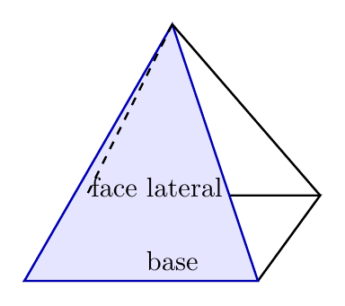
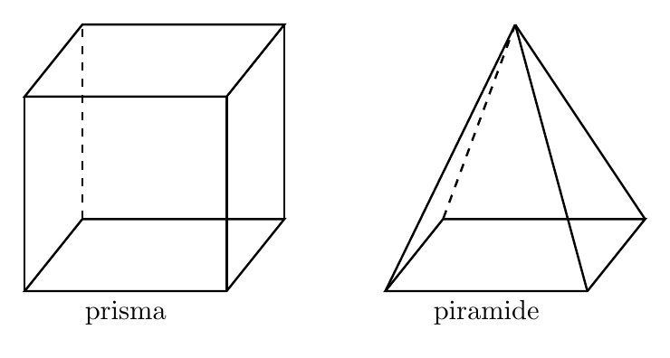
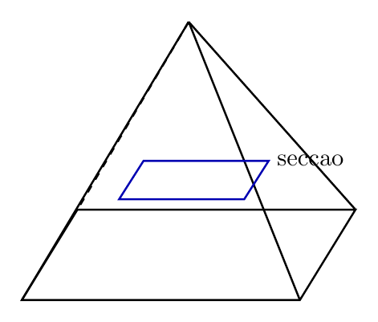
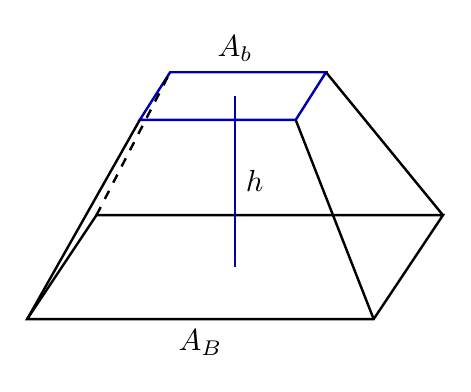

# Capítulo 2 — Áreas, Volumes e Tronco de Pirâmide

## Por que aparece o fator um terço?

Um silo de grãos em forma de tronco de pirâmide não pode ser medido como um prisma comum, porque suas secções mudam de tamanho. Uma pirâmide inteira também afunila até o ápice, por isso ocupa menos espaço que o prisma de mesma base e mesma altura. O cálculo exige identificar base, altura, apótema lateral e, no tronco, as duas bases paralelas.

> 💭 **Pense um pouco:**  
> Quando um recipiente afunila, por que não basta fazer média simples entre as duas bases?

## 1. Área Lateral e Área Total

A área de uma pirâmide depende das faces triangulares e da única base.

### 1.1 Somando faces triangulares

A **área lateral** é a soma das áreas das faces laterais. Em uma pirâmide regular, as faces laterais são triângulos congruentes, e o apótema lateral $$g$$ funciona como altura desses triângulos.

Para uma pirâmide regular:

$$A_L = \frac{P_{\mathrm{base}} \cdot g}{2}$$

onde $$P_{\mathrm{base}}$$ é o perímetro da base e $$g$$ é o apótema lateral.

Essa fórmula vem da soma das áreas dos triângulos laterais. Como as bases desses triângulos formam o perímetro da base, somamos todos os lados da base e multiplicamos pela altura lateral $$g$$.

### 1.2 Por que a pirâmide tem uma única base

A **área total** da pirâmide é a área lateral somada à área da única base.

$$A_T = A_L + A_B$$

Não usamos $$2A_B$$, pois pirâmides não têm duas bases paralelas como prismas.

**Exemplo**

Uma pirâmide quadrangular regular tem lado da base de 8 cm e apótema lateral de 10 cm. Calcule a área lateral.

$$P_{\mathrm{base}} = 4 \cdot 8$$

$$P_{\mathrm{base}} = 32\mathrm{cm}$$

$$A_L = \frac{P_{\mathrm{base}} \cdot g}{2}$$

$$A_L = \frac{32 \cdot 10}{2}$$

$$A_L = 160\mathrm{cm}^2$$

Se a área da base é $$64\mathrm{cm}^2$$:

$$A_T = A_L + A_B$$

$$A_T = 160 + 64$$

$$A_T = 224\mathrm{cm}^2$$

## 2. Volume da Pirâmide

O volume da pirâmide é um terço do volume do prisma de mesma base e mesma altura.

### 2.1 O prisma de mesma base e mesma altura

Considere um prisma e uma pirâmide com a mesma área da base $$A_B$$ e a mesma altura $$h$$.

O prisma ocupa:

$$V_{\mathrm{prisma}} = A_B \cdot h$$

A pirâmide correspondente ocupa:

$$V = \frac{1}{3} \cdot A_B \cdot h$$

### 2.2 O fator 1/3

O fator $$\frac{1}{3}$$ pode ser justificado por comparação geométrica: um prisma triangular pode ser decomposto em três pirâmides equivalentes, e o Princípio de Cavalieri reforça a comparação por secções paralelas.

**Exemplo**

Uma pirâmide tem base quadrada de área $$81\mathrm{cm}^2$$ e altura de 12 cm. Calcule o volume.

$$V = \frac{1}{3} \cdot A_B \cdot h$$

$$V = \frac{1}{3} \cdot 81 \cdot 12$$

$$V = \frac{972}{3}$$

$$V = 324\mathrm{cm}^3$$

> 📐 **Fazendo as Contas:**  
> O fator um terço só vale quando a pirâmide e o prisma comparados têm a mesma base e a mesma altura.

## 3. O que é Tronco de Pirâmide

Um tronco de pirâmide surge quando uma pirâmide é cortada por um plano paralelo à base.

### 3.1 Secção paralela à base

O **tronco de pirâmide** é a parte da pirâmide entre a base original e uma secção paralela a essa base.

Na secção paralela:

- a base maior permanece na parte inferior;
- a base menor aparece no corte;
- as faces laterais deixam de ser triângulos inteiros;
- o sólido resultante possui duas bases paralelas.

### 3.2 Bases paralelas e faces trapezoidais

No tronco de pirâmide, as faces laterais são trapézios. A altura do tronco é a distância perpendicular entre as duas bases paralelas.

Elementos:

- $$A_B$$ é a área da base maior;
- $$A_b$$ é a área da base menor;
- $$h$$ é a altura do tronco;
- as faces laterais são trapezoidais.

## 4. Volume do Tronco

O volume do tronco combina as duas bases e um termo médio entre elas.

### 4.1 A fórmula generalizada

O volume do tronco de pirâmide é:

$$V_{\mathrm{tronco}} = \frac{h}{3}(A_B + A_b + \sqrt{A_B \cdot A_b})$$

O termo $$\sqrt{A_B \cdot A_b}$$ funciona como uma média geométrica entre as áreas das bases. Ele preserva a relação entre a base maior e a base menor.

Quando as bases são quadradas de arestas $$a$$ e $$b$$:

$$V_{\mathrm{tronco}} = \frac{h}{3}(a^2 + b^2 + ab)$$

### 4.2 Aplicações em embalagens e silos

**Exemplo**

Um silo em forma de tronco de pirâmide tem altura de 6 m, base maior quadrada de lado 4 m e base menor quadrada de lado 2 m. Calcule o volume.

$$A_B = 4^2$$

$$A_B = 16\mathrm{m}^2$$

$$A_b = 2^2$$

$$A_b = 4\mathrm{m}^2$$

$$V_{\mathrm{tronco}} = \frac{h}{3}(A_B + A_b + \sqrt{A_B \cdot A_b})$$

$$V_{\mathrm{tronco}} = \frac{6}{3}(16 + 4 + \sqrt{16 \cdot 4})$$

$$V_{\mathrm{tronco}} = 2(20 + \sqrt{64})$$

$$V_{\mathrm{tronco}} = 2(20 + 8)$$

$$V_{\mathrm{tronco}} = 56\mathrm{m}^3$$

---

## NA VIDA REAL

Embalagens, reservatórios e silos podem ter forma de tronco de pirâmide porque essa forma facilita empilhamento, escoamento ou estabilidade. Para estimar capacidade, não basta usar a base maior nem a base menor isoladamente. O volume depende das duas bases, da altura e do termo médio que conecta as áreas.

---

## E A BÍBLIA NISSO?

> *"Quem é fiel no pouco também é fiel no muito."*  
> Lucas 16.10

Nas fórmulas de pirâmides e troncos, cada termo tem uma função. Um erro pequeno na altura, na base ou no apótema compromete o resultado final.

- **Fidelidade nas partes sustenta o resultado.** O cálculo confiável depende de identificar e usar cada medida corretamente.

> 💬 **Para Conversar:**  
> Por que um erro pequeno em uma medida pode gerar grande diferença no volume?

---

## Simplificando

A área lateral de uma pirâmide regular vem da soma das faces triangulares, e a área total soma essa área à única base. O volume da pirâmide é $$V = \frac{1}{3} \cdot A_B \cdot h$$, enquanto o tronco exige uma fórmula própria porque combina duas bases paralelas.

---

## Para não esquecer

- Área lateral soma faces triangulares;
- Área total da pirâmide é $$A_T = A_L + A_B$$;
- Pirâmide tem uma única base;
- Volume da pirâmide é um terço do prisma correspondente;
- Tronco de pirâmide tem duas bases paralelas e faces laterais trapezoidais.
