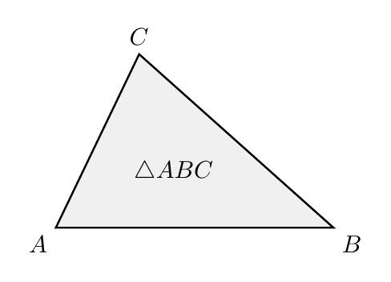
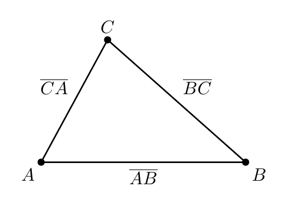
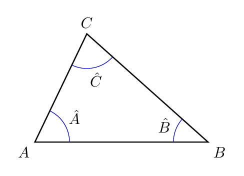
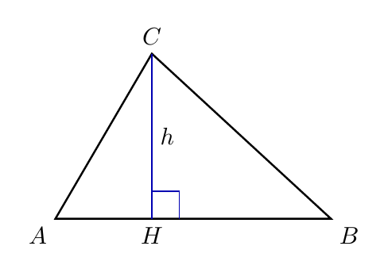
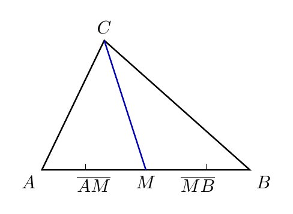
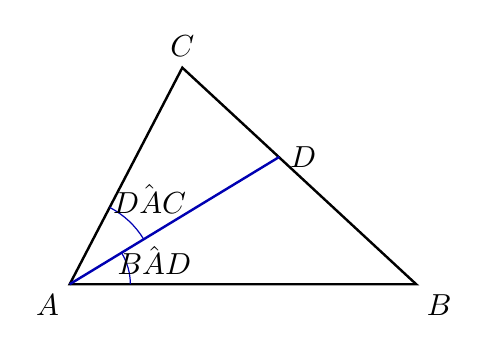

# Capítulo 1 — Elementos dos Triângulos

## O que sustenta um triângulo?

Em telhados, pontes e placas de trânsito, o triângulo aparece quando a estrutura precisa ficar firme. A figura parece simples, mas cada parte tem uma função que ajuda a organizar o desenho. Para entender essa firmeza, é preciso olhar para lados, vértices, ângulos e segmentos internos com atenção.

> 💭 **Pense um pouco:**  
> O que acontece quando uma estrutura perde uma de suas partes?

## 1. O Triângulo Como Polígono

Um **triângulo** é um **polígono** formado por 3 lados.

### 1.1 Três lados e três vértices

Todo triângulo tem 3 lados, 3 vértices e uma região interna limitada por esses lados. Observe uma figura com três segmentos ligados ponta a ponta, formando uma estrutura fechada.

Três elementos precisam aparecer juntos:

- **Lado:** segmento que liga dois vértices;
- **Vértice:** ponto onde dois lados se encontram;
- **Região interna:** parte do plano que fica dentro dos três lados.

Se faltar um lado, a figura não fica fechada; se faltar um vértice, os segmentos não se encontram corretamente.

> 🏗️ **Geometria ao Redor:**  
> Treliças triangulares são usadas em telhados porque três barras bem ligadas formam uma estrutura difícil de deformar.

### 1.2 Como nomear um triângulo

Um triângulo costuma ser nomeado pelas letras de seus vértices. No triângulo com vértices A, B e C, escrevemos:

$$\triangle ABC$$

Os lados recebem o nome dos dois vértices que ligam:

$$\overline{AB}$$

$$\overline{BC}$$

$$\overline{CA}$$

Ao observar a figura, repare que cada lado nasce de uma ligação entre dois pontos.

Uma leitura correta segue esta ordem:

- primeiro marque os **vértices** A, B e C;
- depois identifique os **lados** entre pares de vértices;
- por fim, leia o nome do triângulo usando os três vértices.

**Exemplo**

No triângulo $$ABC$$, o lado $$\overline{AB}$$ liga o vértice A ao vértice B. O lado $$\overline{BC}$$ liga B a C, e o lado $$\overline{CA}$$ liga C a A.

## 2. Ângulos Internos

Cada vértice do triângulo forma um ângulo voltado para dentro da figura.

### 2.1 O ângulo que nasce em cada vértice

Um **ângulo interno** é a abertura formada por dois lados consecutivos dentro do triângulo. No triângulo $$ABC$$, os ângulos internos são:

$$\hat{A}$$

$$\hat{B}$$

$$\hat{C}$$

Na figura, cada arco marca a abertura que nasce em um vértice.

Para identificar um ângulo interno, observe três informações:

- o **vértice** onde a abertura aparece;
- os **dois lados** que formam essa abertura;
- a **região interna** para onde o ângulo está voltado.

O ângulo $$\hat{A}$$ nasce no vértice A porque os lados que se encontram ali formam a abertura interna do triângulo.

### 2.2 Identificando ângulos no desenho

Ler um ângulo no desenho é diferente de apenas decorar sua letra. A letra indica o vértice, mas a abertura depende dos lados que chegam a esse vértice.

Uma marcação visual segura segue esta sequência:

- encontre o vértice indicado;
- veja quais dois lados se encontram nele;
- marque a abertura que fica dentro do triângulo.

**Exemplo**

No triângulo $$ABC$$, o ângulo $$\hat{B}$$ fica no ponto B e é formado pelos lados $$\overline{BA}$$ e $$\overline{BC}$$. Se a marca for desenhada fora do triângulo, ela não representa o ângulo interno.

> 👁️ **Observe:**  
> A mesma letra pode estar perto de vários traços, mas o ângulo interno sempre fica na abertura de dentro do triângulo.

## 3. Segmentos Notáveis

Alguns segmentos ajudam a enxergar relações importantes dentro de um triângulo sem mudar sua forma.

### 3.1 Altura

A **altura** é o segmento perpendicular que sai de um vértice e chega ao lado oposto ou ao prolongamento desse lado. Perpendicular significa que o encontro forma um ângulo reto.

Na figura, a altura sai do vértice C e encontra o lado $$\overline{AB}$$ em H.

Duas ideias são essenciais:

- a altura sempre parte de um **vértice**;
- a altura sempre chega ao lado oposto ou ao seu prolongamento formando perpendicularidade.

Em alguns triângulos, a altura fica dentro da figura; em outros, especialmente quando há um ângulo bem aberto, ela pode cair fora e encontrar apenas o prolongamento do lado.

### 3.2 Mediana

A **mediana** é o segmento que sai de um vértice e chega ao ponto médio do lado oposto. O **ponto médio** divide um segmento em duas partes congruentes.

Na figura, M é o ponto médio de $$\overline{AB}$$, e o segmento que liga C a M é uma mediana.

A relação de ponto médio pode ser registrada assim:

$$\overline{AM} = \overline{MB}$$

Para reconhecer uma mediana, verifique estes elementos:

- ela sai de um **vértice**;
- ela chega ao **ponto médio** do lado oposto;
- as duas partes do lado oposto têm a mesma medida.

**Exemplo**

Se M está no lado $$\overline{AB}$$ e $$\overline{AM} = \overline{MB}$$, então M é ponto médio de $$\overline{AB}$$. O segmento $$\overline{CM}$$ é uma mediana.

### 3.3 Bissetriz

A **bissetriz** é o segmento que sai de um vértice e divide o ângulo interno em duas partes congruentes. Congruentes significa que têm a mesma medida.

Na figura, o segmento $$\overline{AD}$$ divide o ângulo do vértice A em duas aberturas iguais.

A relação da bissetriz pode ser registrada assim:

$$\hat{BAD} = \hat{DAC}$$

Para reconhecer uma bissetriz, observe:

- ela sai de um **vértice**;
- ela fica dentro do ângulo interno;
- ela divide esse ângulo em duas partes de mesma medida.

> ⏸️ **Pare e Pense:**  
> Se um segmento sai de um vértice, mas não divide o ângulo em duas partes iguais, ele pode ser chamado de bissetriz?

## 4. Comparando Elementos

Altura, mediana e bissetriz podem parecer parecidas porque todas são segmentos dentro do triângulo, mas cada uma responde a uma pergunta diferente.

### 4.1 O que muda de uma figura para outra

Uma mesma linha pode ter funções diferentes em triângulos especiais, mas isso não torna os nomes sinônimos. A altura fala de perpendicularidade, a mediana fala de ponto médio, e a bissetriz fala de divisão de ângulo.

Compare as perguntas que cada segmento responde:

- **Altura:** o segmento forma ângulo reto com o lado oposto?
- **Mediana:** o segmento chega ao ponto médio do lado oposto?
- **Bissetriz:** o segmento divide o ângulo interno em duas partes congruentes?

Quando uma dessas perguntas muda, o elemento geométrico também muda.

### 4.2 Erros comuns de marcação

O erro mais comum é olhar apenas para a posição do segmento e ignorar sua função. Um segmento que "parece estar no meio" não é necessariamente mediana, e um segmento inclinado não deixa de ser altura se for perpendicular ao lado oposto ou ao prolongamento.

Três cuidados evitam confusão:

- não chamar todo segmento interno de altura;
- não chamar todo segmento que sai de um vértice de mediana;
- não chamar todo segmento que passa pelo interior do ângulo de bissetriz.

**Exemplo**

Se um segmento sai de C e encontra $$\overline{AB}$$ formando ângulo reto, ele pode ser uma altura. Para ser mediana, precisaria encontrar o ponto médio de $$\overline{AB}$$; para ser bissetriz, precisaria dividir o ângulo em C em duas partes congruentes.

---

## NA VIDA REAL

Em telhados, pontes e suportes metálicos, o triângulo é usado porque seus lados e vértices formam uma estrutura estável. Mas essa estabilidade depende de cada parte estar no lugar certo: lado, vértice e ângulo não são nomes decorativos. Saber identificar esses elementos ajuda a ler desenhos técnicos, placas, estruturas e projetos com mais precisão.

---

## E A BÍBLIA NISSO?

> *"Quem anda em integridade anda seguro, mas o que perverte os seus caminhos será conhecido."*  
> Provérbios 10.9

Cada elemento do triângulo tem uma função própria: lado não é vértice, altura não é mediana, bissetriz não é qualquer segmento interno. A integridade também envolve coerência entre o que uma pessoa é, diz e faz; quando as partes estão desalinhadas, a estrutura perde firmeza.

- **Cada parte precisa cumprir sua função.** Assim como um triângulo firme depende de elementos bem definidos, uma vida íntegra depende de escolhas coerentes com a verdade.

> 💬 **Para Conversar:**  
> Em que situação uma pequena falta de coerência pode comprometer uma estrutura inteira?

---

## Simplificando

Todo triângulo tem 3 lados, 3 vértices e 3 ângulos internos, e pode ser nomeado pelos seus vértices. Altura, mediana e bissetriz são segmentos diferentes porque cada um depende de uma propriedade específica: perpendicularidade, ponto médio ou divisão de ângulo.

---

## Para não esquecer

- Triângulo: polígono formado por 3 lados;
- Lado: segmento que liga dois vértices;
- Vértice: ponto onde dois lados se encontram;
- Ângulo interno: abertura formada por dois lados dentro do triângulo;
- Segmentos notáveis: altura, mediana e bissetriz têm funções diferentes.
