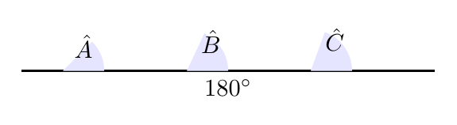
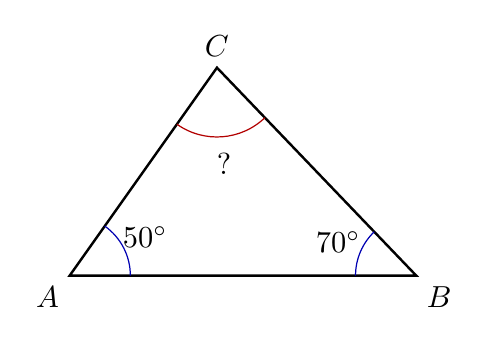
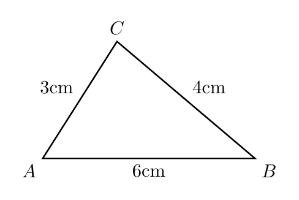

# Capítulo 3 — Propriedades dos Triângulos

## Todo triângulo obedece às mesmas regras?

Imagine recortar um triângulo de papel, destacar seus três cantos e colocá-los lado a lado. Mesmo que o triângulo mude de tamanho ou formato, os cantos se encaixam formando uma linha reta. Algumas propriedades não dependem da aparência do desenho.

> 💭 **Pense um pouco:**  
> Que regras continuam valendo mesmo quando o desenho muda?

## 1. A Soma dos Ângulos Internos

Todo triângulo tem uma propriedade fixa: a soma dos seus ângulos internos é $$180^{\circ}$$.

### 1.1 O experimento dos três cantos

Quando os três cantos de um triângulo de papel são colocados lado a lado, eles formam um ângulo raso. Um ângulo raso mede $$180^{\circ}$$.

Na figura, os três ângulos internos aparecem reunidos sobre uma linha reta.  

O experimento mostra uma ideia importante:

- cada canto representa um ângulo interno;
- os três cantos juntos formam uma linha reta;
- a linha reta representa $$180^{\circ}$$.

> 💡 **Você sabia?**  
> Esse experimento visual funciona com triângulos de formatos diferentes, não apenas com um desenho específico.

### 1.2 A regra dos 180 graus

A propriedade pode ser escrita assim:

$$\hat{A} + \hat{B} + \hat{C} = 180^{\circ}$$

Essa igualdade significa que os três ângulos internos sempre completam $$180^{\circ}$$.

Para usar a regra, siga:

- identifique os três ângulos internos;
- some os ângulos conhecidos;
- complete até $$180^{\circ}$$.

Se dois ângulos são conhecidos, o terceiro pode ser calculado.

## 2. Encontrando Ângulos Desconhecidos

Um ângulo desconhecido pode ser encontrado subtraindo os ângulos conhecidos de $$180^{\circ}$$.

### 2.1 Substituir os valores

Se os ângulos conhecidos são $$50^{\circ}$$ e $$70^{\circ}$$, o ângulo que falta pode ser chamado de $$\hat{C}$$.

Use uma etapa por linha:

$$\hat{A} + \hat{B} + \hat{C} = 180^{\circ}$$

$$50^{\circ} + 70^{\circ} + \hat{C} = 180^{\circ}$$

$$120^{\circ} + \hat{C} = 180^{\circ}$$

$$\hat{C} = 180^{\circ} - 120^{\circ}$$

$$\hat{C} = 60^{\circ}$$

Na figura, o ângulo desconhecido aparece no vértice C.  

### 2.2 Conferir a soma

Depois de calcular, é preciso conferir se os três ângulos realmente somam $$180^{\circ}$$.

A conferência fica assim:

$$50^{\circ} + 70^{\circ} + 60^{\circ} = 180^{\circ}$$

Três cuidados ajudam:

- não esquecer nenhum ângulo;
- não somar lado com ângulo;
- conferir se o resultado final completa $$180^{\circ}$$.

**Exemplo**

Um triângulo tem ângulos de $$35^{\circ}$$ e $$85^{\circ}$$. Qual é o terceiro?

$$35^{\circ} + 85^{\circ} + \hat{C} = 180^{\circ}$$

$$120^{\circ} + \hat{C} = 180^{\circ}$$

$$\hat{C} = 60^{\circ}$$

## 3. A Desigualdade Triangular

Três medidas só formam um triângulo se cada lado for menor que a soma dos outros dois.

### 3.1 Quando três medidas formam triângulo

Tente imaginar três varetas: se uma vareta for comprida demais, as outras duas não conseguem fechar a figura. Essa é a ideia da **desigualdade triangular**.

A regra completa é:

$$a < b + c$$

$$b < a + c$$

$$c < a + b$$

Na figura, as varetas conseguem se encontrar e fechar um triângulo.  

Para testar medidas, observe:

- compare cada lado com a soma dos outros dois;
- se todas as comparações forem verdadeiras, forma triângulo;
- se uma comparação falhar, não forma triângulo.

### 3.2 O teste do lado maior

Na prática, basta comparar o maior lado com a soma dos outros dois. Se o maior lado for menor que essa soma, as medidas formam triângulo.

Há três casos importantes:

- **caso possível:** o maior lado é menor que a soma dos outros dois;
- **caso limite:** o maior lado é igual à soma dos outros dois;
- **caso impossível:** o maior lado é maior que a soma dos outros dois.

**Exemplo**

As medidas 3 cm, 4 cm e 6 cm formam triângulo?

O maior lado é 6 cm.

$$3 + 4 = 7$$

$$6 < 7$$

Como o maior lado é menor que a soma dos outros dois, as medidas formam triângulo.

> ⏸️ **Pare e Pense:**  
> Por que 3 cm, 4 cm e 10 cm não conseguem fechar um triângulo?

## 4. Aplicando as Duas Propriedades

As propriedades ajudam a verificar ângulos e lados sem depender de desenho perfeito.

### 4.1 Exemplos resolvidos

**Exemplo**

Um triângulo tem ângulos $$45^{\circ}$$, $$65^{\circ}$$ e $$x$$. Determine $$x$$.

$$45^{\circ} + 65^{\circ} + x = 180^{\circ}$$

$$110^{\circ} + x = 180^{\circ}$$

$$x = 70^{\circ}$$

**Exemplo**

As medidas 5 cm, 5 cm e 11 cm formam triângulo?

O maior lado é 11 cm.

$$5 + 5 = 10$$

$$11 > 10$$

Como o maior lado é maior que a soma dos outros dois, não forma triângulo.

### 4.2 Erros comuns

O erro mais comum é aceitar qualquer trio de medidas só porque há três números. Três medidas não bastam; elas precisam fechar a figura.

Evite estas confusões:

- achar que todo trio de medidas forma triângulo;
- esquecer que o caso limite não forma triângulo;
- calcular ângulo desconhecido sem conferir a soma final.

---

## NA VIDA REAL

Barracas, suportes triangulares e armações com varetas dependem de medidas que consigam fechar uma figura. Se uma peça for longa demais, a estrutura não se monta. A desigualdade triangular ajuda a prever isso antes de cortar material ou tentar montar a peça.

---

## E A BÍBLIA NISSO?

> *"Todo aquele, pois, que ouve estas minhas palavras e as pratica será comparado a um homem prudente que edificou a sua casa sobre a rocha."*  
> Mateus 7.24

As propriedades do triângulo são regras estáveis: valem mesmo quando o desenho muda. A integridade também depende de fundamentos firmes, não de improviso ou aparência.

- **Regra firme sustenta decisão firme.** Assim como um triângulo só existe quando suas medidas obedecem a uma condição, uma vida prudente precisa de fundamentos que não mudam conforme a situação.

> 💬 **Para Conversar:**  
> Que regra importante você precisa manter mesmo quando ninguém está olhando?

---

## Simplificando

Todo triângulo tem soma dos ângulos internos igual a $$180^{\circ}$$, e essa propriedade ajuda a encontrar ângulos desconhecidos. Três medidas só formam triângulo quando o maior lado é menor que a soma dos outros dois.

---

## Para não esquecer

- Soma interna: os três ângulos de um triângulo somam $$180^{\circ}$$;
- Ângulo desconhecido: subtraia os ângulos conhecidos de $$180^{\circ}$$;
- Desigualdade triangular: cada lado deve ser menor que a soma dos outros dois;
- Lado maior: compare-o com a soma dos outros dois lados;
- Caso limite: igualdade não fecha triângulo, forma uma linha reta.
