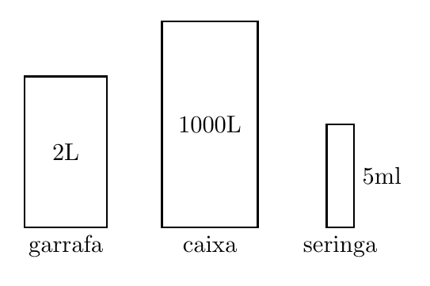
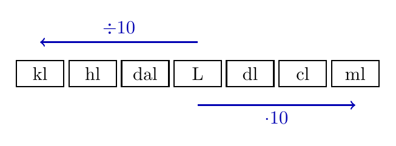
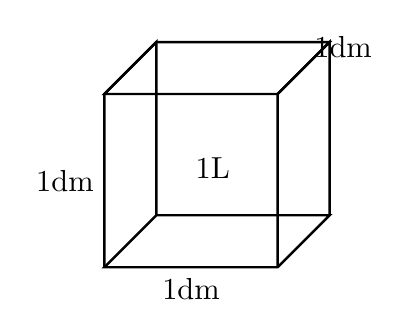

# Capítulo 4 — Medidas de Capacidade

## Quanto cabe dentro?

Uma garrafa pode ter 2 L, uma caixa d'água pode ter 1000 L e uma seringa pode marcar 5 ml. Os recipientes são muito diferentes, mas todos falam de quanto cabe dentro. Para comparar essas medidas, precisamos usar a mesma escala com precisão.

> 💭 **Pense um pouco:**  
> Por que uma mesma quantidade pode aparecer com nomes diferentes?

## 1. O Litro

A **capacidade** indica a quantidade de líquido ou fluido que cabe em um recipiente.

### 1.1 Capacidade

Medir capacidade é responder à pergunta: quanto cabe aqui dentro? Essa medida aparece em garrafas, copos, caixas d'água, seringas e receitas.

Na figura, recipientes de tamanhos diferentes mostram capacidades diferentes.  

Três ideias são importantes:

- capacidade se refere ao que cabe em um recipiente;
- a unidade precisa acompanhar o número;
- comparar capacidades exige converter para unidades compatíveis.

### 1.2 Litro no cotidiano

O **litro**, indicado por L, é a unidade central de capacidade no cotidiano escolar. Uma garrafa de refrigerante, por exemplo, costuma ser marcada em litros.

Algumas referências ajudam:

- 1 L aparece em garrafas e caixas pequenas;
- 2 L aparece em garrafas PET grandes;
- 1000 L aparece em caixas d'água.

**Exemplo**

Uma garrafa de 2 L tem capacidade maior que uma garrafa de 500 ml. Para comparar com precisão, podemos converter 2 L para mililitros.

## 2. Múltiplos e Submúltiplos

A escala de capacidade tem unidades maiores e menores que o litro.

### 2.1 Unidades maiores que o litro

Os **múltiplos** do litro são unidades maiores usadas para capacidades grandes.

As relações principais são:

$$1\mathrm{kl} = 1000\mathrm{L}$$

$$1\mathrm{hl} = 100\mathrm{L}$$

$$1\mathrm{dal} = 10\mathrm{L}$$

Use estas ideias:

- **kl:** quilolitro, usado para quantidades muito grandes;
- **hl:** hectolitro, maior que o litro;
- **dal:** decalitro, igual a 10 L.

Uma caixa d'água de 1000 L tem capacidade de 1 kl.

### 2.2 Unidades menores que o litro

Os **submúltiplos** do litro são unidades menores usadas em receitas, copos, medicamentos e pequenos frascos.

As relações principais são:

$$1\mathrm{L} = 10\mathrm{dl}$$

$$1\mathrm{L} = 100\mathrm{cl}$$

$$1\mathrm{L} = 1000\mathrm{ml}$$

Na figura, a escala mostra unidades maiores e menores que o litro.  

Três unidades aparecem com frequência:

- **dl:** decilitro;
- **cl:** centilitro;
- **ml:** mililitro.

> 📏 **Medidas Impressionantes:**  
> Uma caixa d'água de 1000 L tem a mesma capacidade que 1000 garrafas de 1 L.

## 3. Convertendo na Escala Decimal

Converter é trocar a unidade mantendo a mesma quantidade.

### 3.1 Descer a escala

Descer a escala significa ir para uma unidade menor. A cada degrau para baixo, multiplicamos por 10.

Para descer a escala:

- de L para dl, multiplique por 10;
- de L para cl, multiplique por 100;
- de L para ml, multiplique por 1000.

**Exemplo**

Converta 2,5 L em ml.

$$1\mathrm{L} = 1000\mathrm{ml}$$

$$2,5\mathrm{L} = 2,5 \cdot 1000\mathrm{ml}$$

$$2,5\mathrm{L} = 2500\mathrm{ml}$$

### 3.2 Subir a escala

Subir a escala significa ir para uma unidade maior. A cada degrau para cima, dividimos por 10.

Para subir a escala:

- de ml para cl, divida por 10;
- de ml para dl, divida por 100;
- de ml para L, divida por 1000.

**Exemplo**

Converta 750 ml em L.

$$1\mathrm{L} = 1000\mathrm{ml}$$

$$750\mathrm{ml} = \frac{750}{1000}\mathrm{L}$$

$$750\mathrm{ml} = 0,75\mathrm{L}$$

## 4. Litro e Espaço Ocupado

O litro também pode ser relacionado ao espaço ocupado por um cubo.

### 4.1 1 L e 1 dm³

De modo intuitivo, 1 L corresponde ao espaço de um cubo com 1 dm de aresta.

$$1\mathrm{L} = 1\mathrm{dm}^3$$

Também vale:

$$1\mathrm{ml} = 1\mathrm{cm}^3$$

Na figura, o cubo representa a ideia de 1 L ocupando um espaço.  

Essa relação serve como ponte:

- o litro mede capacidade;
- o decímetro cúbico mede espaço ocupado;
- as duas ideias se encontram em recipientes.

### 4.2 Exemplos resolvidos

**Exemplo**

Uma receita pede 300 ml de leite. Quantos litros são?

$$300\mathrm{ml} = \frac{300}{1000}\mathrm{L}$$

$$300\mathrm{ml} = 0,3\mathrm{L}$$

**Exemplo**

Uma caixa tem capacidade de 3 kl. Quantos litros cabem nela?

$$1\mathrm{kl} = 1000\mathrm{L}$$

$$3\mathrm{kl} = 3 \cdot 1000\mathrm{L}$$

$$3\mathrm{kl} = 3000\mathrm{L}$$

---

## NA VIDA REAL

Rótulos de embalagens, receitas e doses de medicamento dependem de medidas de capacidade. Confundir ml com L pode gerar uma quantidade muito maior ou muito menor do que a necessária. Converter corretamente ajuda a medir, comparar e usar recipientes com responsabilidade.

---

## E A BÍBLIA NISSO?

> *"Como passa a tempestade, assim desaparece o perverso, mas o justo tem fundamento perpétuo."*  
> Provérbios 10.25

Medidas confiáveis dependem de uma escala estável: 1 L é sempre 1000 ml. A integridade também exige fundamento estável, para que promessa e entrega correspondam.

- **Medida certa entrega o que promete.** Assim como uma conversão correta preserva a quantidade, uma atitude íntegra preserva a verdade entre o que se diz e o que se faz.

> 💬 **Para Conversar:**  
> Por que pequenas diferenças de medida podem causar grandes problemas?

---

## Simplificando

Capacidade mede quanto cabe em um recipiente, e o litro é a unidade central dessa medida. Para converter na escala decimal, descemos multiplicando por 10 a cada degrau e subimos dividindo por 10 a cada degrau.

---

## Para não esquecer

- Capacidade: quantidade que cabe em um recipiente;
- Litro: unidade central de capacidade no cotidiano;
- Múltiplos: kl, hl e dal são maiores que o litro;
- Submúltiplos: dl, cl e ml são menores que o litro;
- Conversão: descer multiplica por 10, subir divide por 10.
