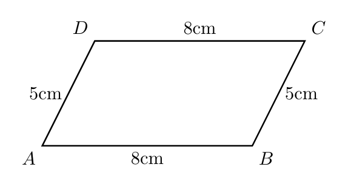
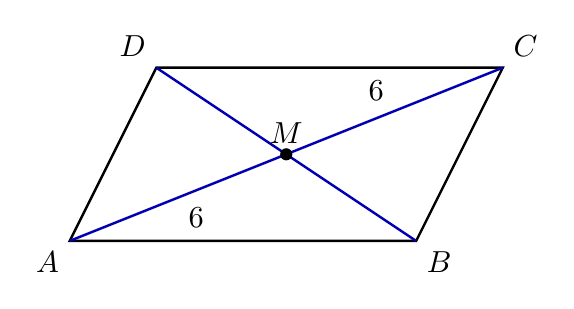
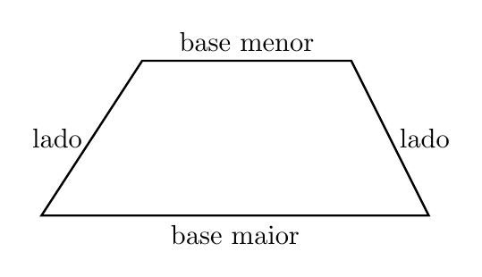
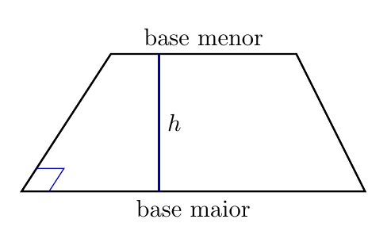

# Capítulo 2 — Propriedades dos Quadriláteros

## O que uma figura promete quando é paralelogramo?

Uma porta retangular fica mais firme quando suas diagonais se cruzam no centro. A classe da figura revela informações que não precisam ser medidas uma por uma. Em um paralelogramo, várias propriedades aparecem juntas.

> 💭 **Pense um pouco:**  
> Que informações aparecem quando sabemos a classe da figura?

## 1. Propriedades dos Paralelogramos

Todo paralelogramo mantém relações fixas entre lados e ângulos.

### 1.1 Lados opostos

Em todo **paralelogramo**, os lados opostos são paralelos e congruentes.

Na figura, os pares opostos têm a mesma medida.

Em um paralelogramo $$ABCD$$:

$$\overline{AB} \cong \overline{CD}$$

$$\overline{AD} \cong \overline{BC}$$

Isso ajuda a encontrar medidas:

- se $$\overline{AB} = 8\mathrm{cm}$$, então $$\overline{CD} = 8\mathrm{cm}$$;
- se $$\overline{AD} = 5\mathrm{cm}$$, então $$\overline{BC} = 5\mathrm{cm}$$.

### 1.2 Ângulos opostos

Em todo paralelogramo, os ângulos opostos são congruentes, e os consecutivos são suplementares.

As relações principais são:

$$\hat{A} \cong \hat{C}$$

$$\hat{B} \cong \hat{D}$$

$$\hat{A} + \hat{B} = 180^{\circ}$$

**Exemplo**

Se $$\hat{A} = 70^{\circ}$$, então o ângulo consecutivo $$\hat{B}$$ mede:

$$\hat{A} + \hat{B} = 180^{\circ}$$

$$70^{\circ} + \hat{B} = 180^{\circ}$$

$$\hat{B} = 110^{\circ}$$

## 2. Diagonais

As diagonais revelam o centro do paralelogramo.

### 2.1 O cruzamento no ponto médio

As **diagonais** de um paralelogramo se cortam no ponto médio. Isso quer dizer que cada diagonal fica dividida em duas partes iguais.

Se as diagonais $$\overline{AC}$$ e $$\overline{BD}$$ se cortam em $$M$$, então:

$$\overline{AM} = \overline{MC}$$

$$\overline{BM} = \overline{MD}$$

**Exemplo**

Se $$\overline{AM} = 6\mathrm{cm}$$, então:

$$\overline{MC} = 6\mathrm{cm}$$

$$\overline{AC} = 12\mathrm{cm}$$

### 2.2 O que muda no retângulo, losango e quadrado

Retângulo, losango e quadrado herdam propriedades de todo paralelogramo, mas também têm propriedades especiais.

Compare:

- todo retângulo tem 4 ângulos retos;
- todo losango tem 4 lados congruentes;
- todo quadrado tem as duas propriedades anteriores;
- nem toda propriedade especial vale para todos os paralelogramos.

> ⏸️ **Pare e Pense:**  
> Se uma propriedade vale só no quadrado, ela pode ser usada em qualquer paralelogramo?

## 3. Trapézios

Trapézios são organizados pelas bases paralelas.

### 3.1 Bases e lados não paralelos

Em um **trapézio**, as bases são os lados paralelos. Como usamos a definição com exatamente 1 par de lados paralelos, os outros dois lados são não paralelos.

Na figura aparecem base maior, base menor e lados não paralelos.

Elementos principais:

- **base maior:** o lado paralelo mais longo;
- **base menor:** o lado paralelo mais curto;
- **lados não paralelos:** lados que ligam uma base à outra.

### 3.2 Altura entre as bases

A **altura** do trapézio é a distância perpendicular entre as bases.

Observe que a altura não precisa coincidir com um lado do trapézio.

Três cuidados ajudam:

- a altura forma ângulo reto com as bases;
- a altura mede distância entre retas paralelas;
- altura não é a mesma coisa que lado inclinado.

## 4. Aplicando Propriedades

Propriedades permitem calcular ou conferir medidas.

### 4.1 Encontrando medidas

Use a propriedade certa para a figura certa.

**Exemplo**

Em um paralelogramo $$ABCD$$, temos $$\overline{AB} = 12\mathrm{cm}$$ e $$\overline{AD} = 7\mathrm{cm}$$. Determine $$\overline{CD}$$ e $$\overline{BC}$$.

$$\overline{AB} \cong \overline{CD}$$

$$\overline{CD} = 12\mathrm{cm}$$

$$\overline{AD} \cong \overline{BC}$$

$$\overline{BC} = 7\mathrm{cm}$$

### 4.2 Erros comuns

O erro mais comum é aplicar uma propriedade especial como se ela valesse sempre.

Evite estas generalizações:

- todo quadrado é paralelogramo, mas nem todo paralelogramo é quadrado;
- diagonais se cortam ao meio em todo paralelogramo, mas isso não basta para chamar a figura de quadrado;
- altura do trapézio deve ser perpendicular às bases, não inclinada.

---

## NA VIDA REAL

Portas, janelas, mesas e estruturas metálicas usam quadriláteros com propriedades estáveis. Conferir diagonais e lados ajuda a perceber se uma peça está alinhada. A geometria transforma uma figura em um conjunto de informações confiáveis.

---

## E A BÍBLIA NISSO?

> *"Faze-me justiça, Senhor, pois tenho andado na minha integridade."*  
> Salmo 26.1

Um paralelogramo não possui uma única característica isolada: suas propriedades aparecem juntas e precisam ser coerentes. A integridade também envolve coerência em várias dimensões da vida.

- **Coerência aparece no conjunto.** Uma propriedade confirma a outra quando a figura é bem classificada.

> 💬 **Para Conversar:**  
> Como uma pequena incoerência pode mudar a interpretação de uma figura inteira?

---

## Simplificando

Em paralelogramos, lados opostos são congruentes, ângulos opostos são congruentes, ângulos consecutivos somam 180 graus e diagonais se cortam ao meio. Em trapézios, as bases paralelas e a altura perpendicular organizam a figura.

---

## Para não esquecer

- Lados opostos de paralelogramos são congruentes;
- Ângulos opostos de paralelogramos são congruentes;
- Ângulos consecutivos de paralelogramos são suplementares;
- Diagonais de paralelogramos se cortam no ponto médio;
- Trapézios têm base maior, base menor e altura.
