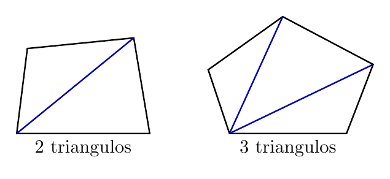
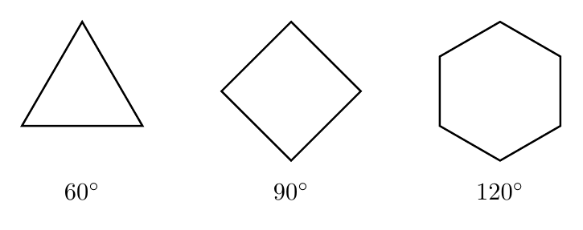
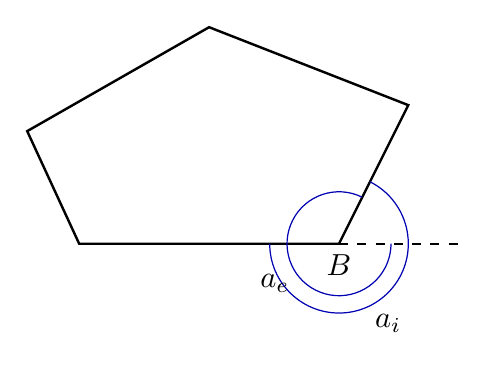
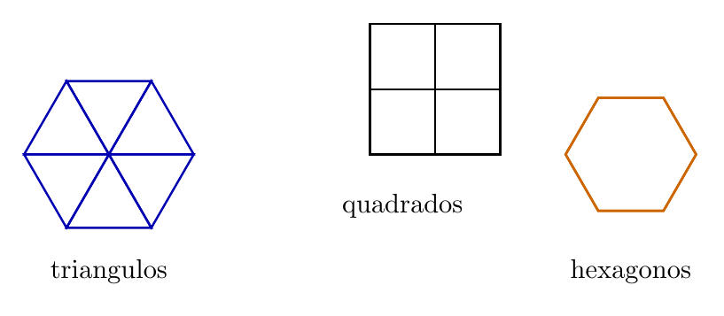

# Capítulo 3 — Ângulos Internos de Polígonos Regulares

## Por que alguns polígonos encaixam sem deixar espaços?

Favos de mel, pisos quadrados e mosaicos com triângulos mostram formas repetidas sem buracos. O encaixe depende do ângulo que chega a cada vértice do desenho. Quando os ângulos completam uma volta inteira, o padrão fecha.

> 💭 **Pense um pouco:**  
> Que ângulo precisa se repetir para preencher uma volta completa?

## 1. Da Soma do Triângulo à Soma do Polígono

A soma dos ângulos internos de um polígono pode ser entendida pela divisão em triângulos.

### 1.1 Triângulos dentro de polígonos

Todo triângulo tem soma dos ângulos internos igual a 180 graus.

$$S = 180^{\circ}$$

Um quadrilátero pode ser dividido em 2 triângulos; um pentágono pode ser dividido em 3; um hexágono, em 4.

O padrão é:

- triângulo: 1 triângulo interno;
- quadrilátero: 2 triângulos internos;
- pentágono: 3 triângulos internos;
- hexágono: 4 triângulos internos.

### 1.2 A fórmula da soma interna

Se um polígono tem $$n$$ lados, ele pode ser dividido em $$n - 2$$ triângulos a partir de um vértice.

A soma dos ângulos internos é:

$$S_i = (n - 2) \cdot 180^{\circ}$$

onde $$n$$ é o número de lados do polígono.

**Exemplo**

Calcule a soma dos ângulos internos de um octógono.

$$n = 8$$

$$S_i = (n - 2) \cdot 180^{\circ}$$

$$S_i = (8 - 2) \cdot 180^{\circ}$$

$$S_i = 6 \cdot 180^{\circ}$$

$$S_i = 1080^{\circ}$$

## 2. Ângulo Interno de Polígono Regular

Em um polígono regular, todos os ângulos internos são congruentes.

### 2.1 Dividir a soma pelo número de lados

Um **polígono regular** tem todos os lados congruentes e todos os ângulos congruentes. Por isso, a soma interna pode ser dividida igualmente entre os vértices.

A medida de cada ângulo interno é:

$$a_i = \frac{(n - 2) \cdot 180^{\circ}}{n}$$

**Exemplo**

Calcule o ângulo interno de um hexágono regular.

$$n = 6$$

$$a_i = \frac{(n - 2) \cdot 180^{\circ}}{n}$$

$$a_i = \frac{(6 - 2) \cdot 180^{\circ}}{6}$$

$$a_i = \frac{720^{\circ}}{6}$$

$$a_i = 120^{\circ}$$

### 2.2 Tabela de polígonos regulares

Valores frequentes ajudam a conferir cálculos.

| Polígono regular | $$n$$ | Soma interna | Cada ângulo interno |
|---|---:|---:|---:|
| Triângulo equilátero | 3 | $$180^{\circ}$$ | $$60^{\circ}$$ |
| Quadrado | 4 | $$360^{\circ}$$ | $$90^{\circ}$$ |
| Pentágono regular | 5 | $$540^{\circ}$$ | $$108^{\circ}$$ |
| Hexágono regular | 6 | $$720^{\circ}$$ | $$120^{\circ}$$ |
| Octógono regular | 8 | $$1080^{\circ}$$ | $$135^{\circ}$$ |

## 3. Ângulos Externos

Ângulos internos e externos se completam em linha reta.

### 3.1 Interno e externo somam 180 graus

Um **ângulo externo** aparece quando prolongamos um lado do polígono. Ele é suplementar ao ângulo interno do mesmo vértice.

$$a_i + a_e = 180^{\circ}$$

**Exemplo**

No hexágono regular, o ângulo interno mede $$120^{\circ}$$.

$$a_i + a_e = 180^{\circ}$$

$$120^{\circ} + a_e = 180^{\circ}$$

$$a_e = 60^{\circ}$$

### 3.2 A volta completa de 360 graus

Em qualquer polígono convexo, a soma dos ângulos externos é 360 graus.

$$S_e = 360^{\circ}$$

Em um polígono regular, todos os externos são iguais:

$$a_e = \frac{360^{\circ}}{n}$$

> 📐 **Fazendo as Contas:**  
> Em um octógono regular, cada ângulo externo mede 45 graus, pois 360 dividido por 8 é 45.

## 4. Mosaicos e Ladrilhamentos

Um mosaico regular fecha quando os ângulos ao redor de um ponto somam 360 graus.

### 4.1 Triângulo, quadrado e hexágono

Só três polígonos regulares preenchem o plano sozinhos: triângulo equilátero, quadrado e hexágono regular.

Isso acontece porque:

- 6 triângulos equiláteros completam 360 graus;
- 4 quadrados completam 360 graus;
- 3 hexágonos regulares completam 360 graus.

### 4.2 Quando o ângulo não fecha 360 graus

O pentágono regular não ladrilha sozinho porque seus ângulos internos medem 108 graus.

Ao tentar encaixar pentágonos regulares ao redor de um ponto:

$$3 \cdot 108^{\circ} = 324^{\circ}$$

$$4 \cdot 108^{\circ} = 432^{\circ}$$

Nenhum desses resultados é 360 graus, então o encaixe não fecha sem sobra ou sobreposição.

---

## NA VIDA REAL

Arquitetura, pisos, azulejos e embalagens usam polígonos regulares para criar padrões. O cálculo dos ângulos mostra por que certas formas encaixam melhor que outras. A geometria explica a regularidade que vemos em mosaicos e estruturas repetidas.

---

## E A BÍBLIA NISSO?

> *"Homem de ânimo dobre é inconstante em todos os seus caminhos."*  
> Tiago 1.8

Um polígono regular mantém a mesma regra em todos os lados e ângulos. A regularidade geométrica lembra que constância e coerência não dependem do tamanho da figura.

- **Regra constante gera forma confiável.** Quando cada parte segue a mesma propriedade, o conjunto se torna previsível.

> 💬 **Para Conversar:**  
> O que muda em um padrão quando uma peça deixa de seguir a mesma regra das outras?

---

## Simplificando

A soma dos ângulos internos de um polígono com $$n$$ lados é calculada por $$S_i = (n - 2) \cdot 180^{\circ}$$. Em polígonos regulares, cada ângulo interno é essa soma dividida por $$n$$, e só triângulo equilátero, quadrado e hexágono regular ladrilham o plano sozinhos.

---

## Para não esquecer

- $$n$$ representa o número de lados;
- A soma interna é $$S_i = (n - 2) \cdot 180^{\circ}$$;
- Em polígono regular, todos os ângulos internos são congruentes;
- Ângulo interno e externo são suplementares;
- Mosaico regular fecha quando os ângulos somam 360 graus.
