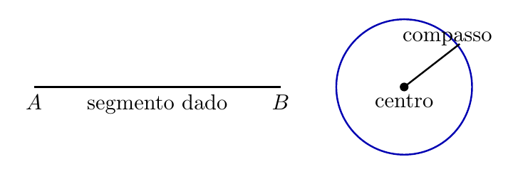
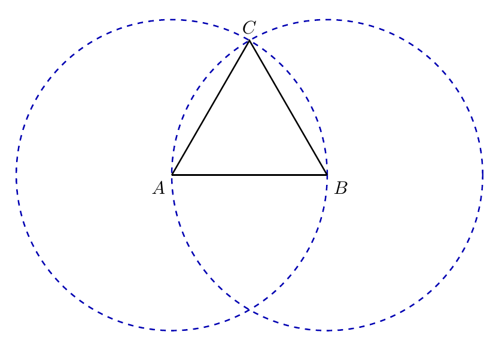
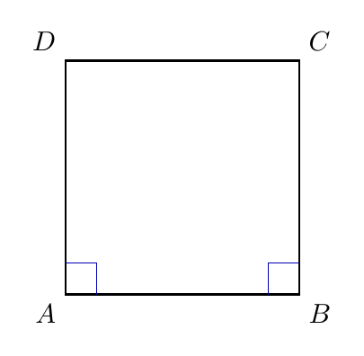
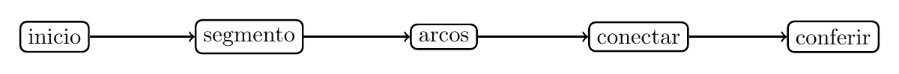
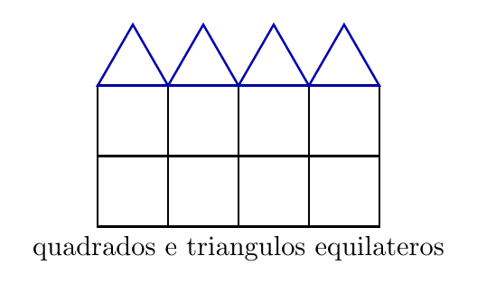

# Capítulo 4 — Construção de Polígonos Regulares

## Como construir regularidade passo a passo?

Um desenho feito à mão livre pode parecer regular, mas pequenas diferenças mudam a figura. Régua e compasso permitem repetir distâncias e controlar direções. A regularidade aparece quando o procedimento é seguido com precisão.

> 💭 **Pense um pouco:**  
> Qual é a diferença entre desenhar parecido e construir corretamente?

## 1. Régua, Compasso e Regularidade

Construção geométrica é desenho feito por passos exatos.

### 1.1 O que cada instrumento faz

A **régua** traça segmentos retos entre pontos. O **compasso** traça circunferências, arcos e transfere distâncias sem mudar a abertura.

Cada instrumento tem uma função:

- régua: conecta pontos por segmentos;
- compasso: mantém uma distância fixa;
- ponto de interseção: marca onde dois traços se encontram;
- conferência: verifica se a propriedade foi preservada.

### 1.2 Por que seguir passos importa

Um polígono regular precisa ter todos os lados congruentes e todos os ângulos congruentes. Por isso, a construção não deve depender apenas do olhar.

Dois cuidados são centrais:

- manter a medida do segmento inicial;
- seguir a ordem dos passos sem pular etapas.

## 2. Triângulo Equilátero

O triângulo equilátero pode ser construído a partir de um segmento dado.

### 2.1 Dois arcos, um terceiro vértice

Comece com um segmento $$\overline{AB}$$. Com o compasso aberto na medida desse segmento, trace um arco com centro em $$A$$ e outro com centro em $$B$$.

Passos:

- trace $$\overline{AB}$$;
- abra o compasso com a medida de $$\overline{AB}$$;
- trace um arco com centro em $$A$$;
- trace outro arco com centro em $$B$$;
- marque a interseção como $$C$$;
- trace $$\overline{AC}$$ e $$\overline{BC}$$.

### 2.2 Conferindo lados iguais

O ponto $$C$$ fica à mesma distância de $$A$$ e de $$B$$ porque foi encontrado por arcos de mesma abertura.

A conferência é:

$$\overline{AB} = \overline{BC} = \overline{CA}$$

Isso confirma que o triângulo é equilátero.

## 3. Quadrado

O quadrado exige lado dado, ângulos retos e transferência de medida.

### 3.1 Lado inicial e ângulos retos

Comece pelo segmento $$\overline{AB}$$. Pelos extremos, trace retas perpendiculares ao lado inicial.

Na construção, os ângulos nos vértices $$A$$ e $$B$$ precisam ser retos.

Use estes critérios:

- o lado inicial define a medida do quadrado;
- as perpendiculares garantem os ângulos retos;
- o compasso transfere a mesma medida para os outros lados.

### 3.2 Transferindo a medida do lado

Com o compasso aberto na medida de $$\overline{AB}$$, marque os pontos $$D$$ e $$C$$ nas perpendiculares. Depois ligue $$C$$ a $$D$$.

A conferência é:

$$\overline{AB} = \overline{BC} = \overline{CD} = \overline{DA}$$

Também precisamos conferir os ângulos retos:

$$\hat{A} = \hat{B} = \hat{C} = \hat{D} = 90^{\circ}$$

## 4. Fluxogramas e Composições

Um procedimento geométrico também pode ser registrado como algoritmo.

### 4.1 Escrevendo o algoritmo

Um **algoritmo** é uma sequência de passos para realizar uma tarefa. Um **fluxograma** representa essa sequência visualmente.

Um bom fluxograma tem:

- início claro;
- passos em ordem;
- decisão ou conferência quando necessário;
- resultado final.

### 4.2 Criando padrões geométricos

Polígonos regulares podem formar composições visuais quando suas propriedades são preservadas.

Em um padrão simples:

- todos os quadrados mantêm lados congruentes e ângulos retos;
- todos os triângulos equiláteros mantêm lados congruentes;
- os encaixes devem respeitar as medidas construídas.

> 👁️ **Observe:**  
> Um padrão bonito ainda precisa preservar as propriedades geométricas para continuar regular.

---

## NA VIDA REAL

Construções com régua e compasso aparecem em desenhos técnicos, projetos, padrões decorativos e estudos de simetria. O procedimento garante que a figura não seja apenas parecida, mas construída com propriedades verificáveis. Seguir passos torna o resultado mais confiável.

---

## E A BÍBLIA NISSO?

> *"Os teus olhos olhem direito, e as tuas pálpebras, diretamente diante de ti."*  
> Provérbios 4.25

Construir uma figura regular exige atenção ao caminho, não apenas ao resultado final. A integridade também aparece quando cada passo é feito com precisão.

- **Processo correto sustenta resultado correto.** Pular etapas pode mudar a figura final mesmo quando o desenho parece bom.

> 💬 **Para Conversar:**  
> Por que seguir o processo importa quando ninguém está vendo cada etapa?

---

## Simplificando

Construir polígonos regulares é seguir um algoritmo com régua e compasso para preservar medidas e ângulos. O triângulo equilátero nasce de dois arcos de mesma abertura, e o quadrado exige lado inicial, perpendiculares e transferência da medida do lado.

---

## Para não esquecer

- Régua traça segmentos retos;
- Compasso transfere distâncias e traça arcos;
- Triângulo equilátero usa dois arcos de mesma abertura;
- Quadrado exige lados congruentes e ângulos retos;
- Fluxograma registra a ordem do procedimento.
