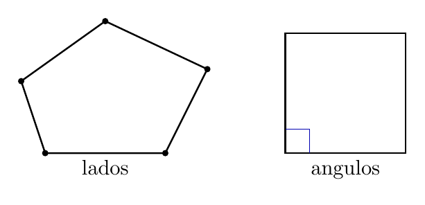
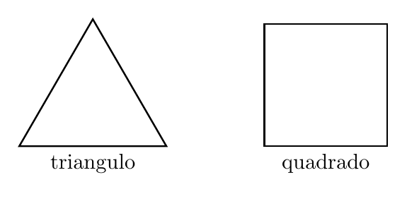
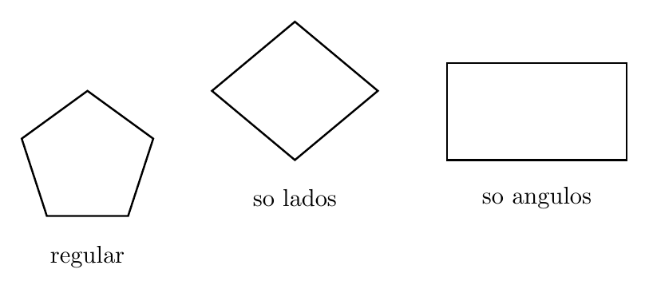
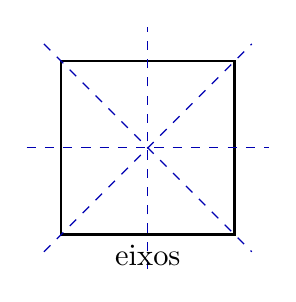
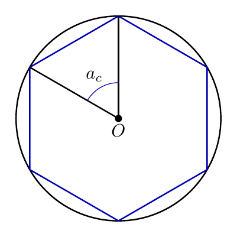

# Capítulo 2 — Polígonos Regulares

## Quando a regularidade é completa?

Uma figura pode parecer equilibrada e ainda falhar em algum detalhe. Se os lados combinam, mas os ângulos não combinam, a regularidade não está completa. Em geometria, ser regular exige duas condições ao mesmo tempo.

> 💭 **Pense um pouco:**  
> Uma figura com lados iguais sempre é regular?

## 1. Regularidade Completa

Um polígono regular precisa ser equilátero e equiângulo.

### 1.1 Lados congruentes

Lados **congruentes** têm a mesma medida. Um polígono **equilátero** tem todos os lados congruentes.

Essa condição verifica:

- se todos os lados têm a mesma medida;
- se nenhum lado ficou maior ou menor;
- se a aparência não está escondendo uma diferença.

### 1.2 Ângulos congruentes

Ângulos **congruentes** têm a mesma medida. Um polígono **equiângulo** tem todos os ângulos congruentes.

Um **polígono regular** é equilátero e equiângulo ao mesmo tempo.

Critério operacional:

- confira todos os lados;
- confira todos os ângulos;
- só classifique como regular se as duas condições forem verdadeiras.

## 2. Exemplos e Contraexemplos

Exemplos e contraexemplos evitam classificação apenas pela aparência.

### 2.1 Triângulo equilátero e quadrado

O **triângulo equilátero** é regular porque seus três lados são congruentes e seus três ângulos também são congruentes.

O **quadrado** é regular porque:

- tem 4 lados congruentes;
- tem 4 ângulos retos;
- mantém a mesma propriedade em todos os vértices.

### 2.2 Pentágono regular e hexágono regular

Pentágono regular e hexágono regular seguem o mesmo critério, mas com mais lados.

Compare:

- pentágono regular: 5 lados congruentes e 5 ângulos congruentes;
- hexágono regular: 6 lados congruentes e 6 ângulos congruentes;
- losango não quadrado: lados congruentes, mas ângulos diferentes;
- retângulo não quadrado: ângulos congruentes, mas lados não todos congruentes.

## 3. Simetria e Padrão

Simetrias ajudam a perceber regularidade, mas não substituem a definição.

### 3.1 Eixos de simetria

Um **eixo de simetria** divide a figura em duas partes correspondentes. Polígonos regulares costumam ter vários eixos de simetria.

Na figura, os eixos passam pelo centro e alinham partes opostas.

Observe:

- o triângulo equilátero tem 3 eixos;
- o quadrado tem 4 eixos;
- o hexágono regular tem 6 eixos.

### 3.2 Giros que preservam a figura

Uma rotação preserva a figura quando, depois do giro, ela volta a coincidir com a posição inicial.

Isso mostra padrão porque:

- o centro organiza os vértices;
- os ângulos centrais se repetem;
- a figura mantém sua forma após giros regulares.

## 4. Circunferência e Ângulo Central

Polígonos regulares podem ser estudados a partir de uma circunferência.

### 4.1 Vértices sobre a circunferência

Um **polígono inscrito** tem todos os vértices sobre uma circunferência. A **circunferência circunscrita** é a que passa por todos esses vértices.

Termos importantes:

- centro: ponto central da circunferência;
- raio: distância do centro até a circunferência;
- vértices: pontos do polígono sobre a circunferência.

### 4.2 Dividindo a volta completa

O **ângulo central** é formado por dois raios que ligam o centro a vértices consecutivos.

Em um polígono regular:

$$a_c = \frac{360^{\circ}}{n}$$

**Exemplo**

No hexágono regular:

$$a_c = \frac{360^{\circ}}{6}$$

$$a_c = 60^{\circ}$$

Essa relação prepara a construção do hexágono regular com compasso.

---

## NA VIDA REAL

Polígonos regulares aparecem em logotipos, vitrais, engrenagens, mosaicos e peças de design. A regularidade completa evita deformações e torna o padrão previsível. Para reconhecer uma figura regular, é preciso olhar para lados e ângulos, não apenas para a aparência.

---

## E A BÍBLIA NISSO?

> *"Quem é fiel no pouco também é fiel no muito."*  
> Lucas 16.10

Um polígono regular não é coerente apenas em uma parte: todos os lados e todos os ângulos precisam obedecer ao mesmo critério. Integridade também aparece quando a coerência se mantém nas pequenas partes e no todo.

- **Regularidade exige completude.** Não basta uma parte estar correta se outra contradiz a definição.

> 💬 **Para Conversar:**  
> Por que uma pequena diferença pode impedir uma figura de ser regular?

---

## Simplificando

Polígono regular é aquele que tem todos os lados congruentes e todos os ângulos congruentes. Quando inscrito em uma circunferência, seus vértices dividem a volta completa em partes iguais, formando ângulos centrais de medida $$\frac{360^{\circ}}{n}$$.

---

## Para não esquecer

- Lados congruentes têm a mesma medida;
- Ângulos congruentes têm a mesma medida;
- Polígono regular é equilátero e equiângulo;
- Polígono inscrito tem vértices sobre uma circunferência;
- O ângulo central regular é $$a_c = \frac{360^{\circ}}{n}$$.
