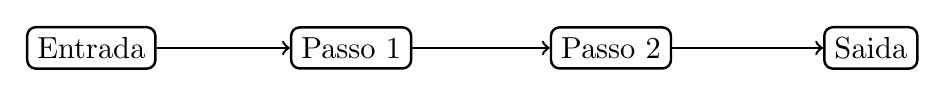
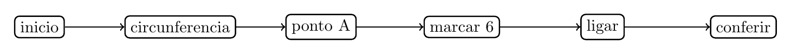
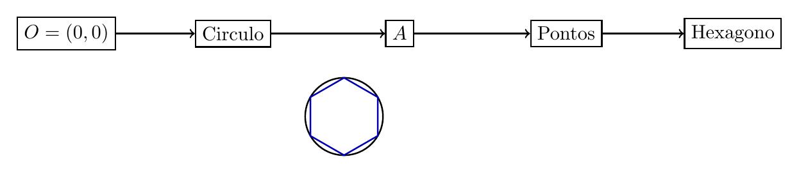

# Capítulo 3 — Algoritmos de Construção

## Como transformar uma construção em instruções?

Saber construir um hexágono com as mãos não garante que outra pessoa consiga repetir a construção. Para reproduzir a mesma figura, os passos precisam ter ordem, nomes e ações claras. Um algoritmo transforma a construção em instruções verificáveis.

> 💭 **Pense um pouco:**  
> Qual instrução do cotidiano falha quando falta um passo?

## 1. Do Fazer ao Descrever

Uma construção geométrica pode ser registrada como algoritmo.

### 1.1 Entrada, passos e saída

Um **algoritmo** é uma sequência ordenada e finita de passos que produz um resultado específico.

Na geometria, ele costuma ter:

- **entrada:** dados iniciais, como centro, raio ou segmento;
- **passos:** ações com régua, compasso ou software;
- **saída:** figura final esperada.

A estrutura pode ser resumida assim:

$$\mathrm{Entrada} \rightarrow \mathrm{Passo\ 1} \rightarrow \mathrm{Passo\ 2} \rightarrow \mathrm{Saida}$$

### 1.2 Onde mora a ambiguidade

Uma instrução é ambígua quando permite mais de uma interpretação.

Compare:

- ruim: "marque outro ponto na circunferência";
- melhor: "com centro em $$A$$ e abertura $$r$$, marque o próximo ponto sobre a circunferência";
- ruim: "ligue os pontos";
- melhor: "ligue os seis pontos consecutivos na ordem em que foram marcados".

## 2. Fluxograma

O fluxograma mostra dependências entre os passos.

### 2.1 Caixas, setas e dependências

Um **fluxograma** representa ações por caixas e sequência por setas. Ele ajuda a ver se algum passo depende de outro que ainda não foi feito.

Um fluxograma simples precisa mostrar:

- início ou entrada;
- ações em ordem;
- repetição da marcação quando necessário;
- saída ou conferência.

### 2.2 Conferindo a ordem dos passos

A ordem importa porque uma ação depende da anterior.

No hexágono:

- não dá para marcar arcos antes de existir circunferência;
- não dá para ligar vértices antes de marcá-los;
- não dá para conferir o fechamento antes de completar seis pontos.

> ⏸️ **Pare e Pense:**  
> Um algoritmo pode estar correto se duas pessoas chegam a figuras diferentes?

## 3. GeoGebra

Softwares de geometria dinâmica executam comandos que correspondem a passos geométricos.

### 3.1 Cada comando como um passo

No GeoGebra, cada comando deve produzir um objeto geométrico claro.

Uma sequência possível para o hexágono:

- criar ponto $$O$$;
- criar circunferência de centro $$O$$ e raio $$r$$;
- marcar ponto $$A$$ na circunferência;
- usar circunferências ou arcos de raio $$r$$ para obter os próximos pontos;
- ligar pontos consecutivos com segmentos.

### 3.2 Testar, observar e corrigir

Testar o algoritmo faz parte do processo. Se a saída não corresponde à figura esperada, a instrução precisa ser revisada.

Procure erros como:

- ponto sem nome;
- raio alterado no meio;
- ordem de ligação incorreta;
- saída sem etapa de conferência.

---

## NA VIDA REAL

Receitas, manuais de montagem, aplicativos de mapa e softwares de desenho dependem de instruções claras. Em geometria, um algoritmo permite que outra pessoa reproduza a mesma construção sem adivinhar. A precisão da linguagem protege a precisão da figura.

---

## E A BÍBLIA NISSO?

> *"Pois qual de vós, pretendendo construir uma torre, não se assenta primeiro para calcular a despesa?"*  
> Lucas 14.28

Antes de construir, é preciso planejar. Um algoritmo geométrico também exige organizar passos antes de esperar um resultado correto.

- **Planejar antes de executar evita erro escondido.** Quando cada passo é claro, a construção pode ser conferida e corrigida.

> 💬 **Para Conversar:**  
> Por que pular uma etapa pode parecer economia de tempo, mas gerar retrabalho?

---

## Simplificando

Algoritmo é geometria escrita em passos finitos, ordenados e sem ambiguidade. Em construções, ele registra entrada, ações, saída e conferência, permitindo repetir a mesma figura manualmente ou em software de geometria dinâmica.

---

## Para não esquecer

- Entrada é o dado inicial;
- Passos precisam estar em ordem;
- Saída é a figura final esperada;
- Ambiguidade permite interpretações diferentes;
- Conferência faz parte do algoritmo.
