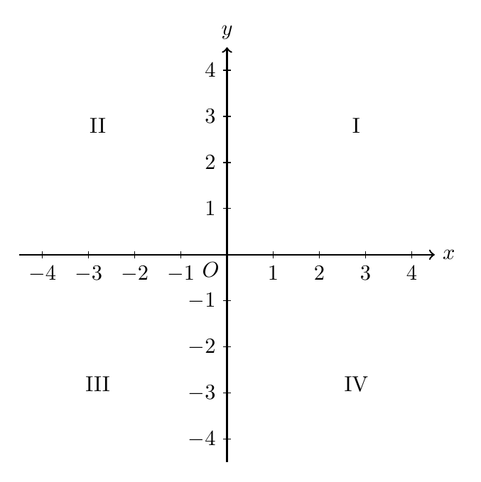
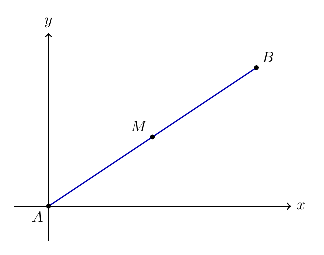
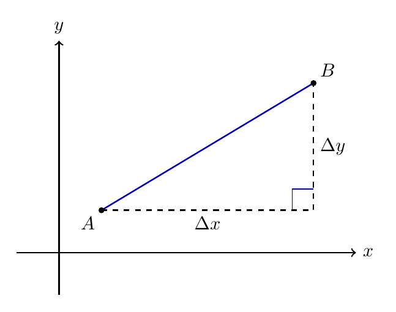
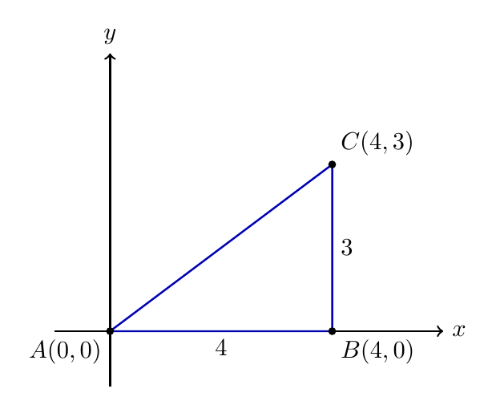

# Capítulo 4 — Geometria Analítica Básica

## Como medir uma figura usando coordenadas?

Um aplicativo de mapa localiza pontos antes de calcular caminhos. No plano cartesiano, uma figura também pode ser descrita por pontos com coordenadas. Quando conhecemos esses pontos, conseguimos calcular meio do caminho, distância, perímetro e área.

> 💭 **Pense um pouco:**  
> Como um aplicativo sabe onde você está?

## 1. Plano Cartesiano

O plano cartesiano transforma posição em par ordenado.

### 1.1 Eixos, origem e quadrantes

O **plano cartesiano** é formado por dois eixos perpendiculares: eixo $$x$$ e eixo $$y$$. Eles se cruzam na **origem**, indicada por $$(0,0)$$.

Elementos principais:

- eixo $$x$$: horizontal;
- eixo $$y$$: vertical;
- origem: ponto onde os eixos se cruzam;
- quadrantes: regiões formadas pelos eixos.

### 1.2 Cada ponto como par ordenado

Um ponto no plano é indicado por um par ordenado.

$$P = (x,y)$$

A primeira coordenada é a **abscissa**; a segunda é a **ordenada**.

Exemplo:

- em $$A = (3,2)$$, a abscissa é 3 e a ordenada é 2;
- em $$B = (-2,4)$$, a abscissa é -2 e a ordenada é 4;
- em $$C = (1,-3)$$, a abscissa é 1 e a ordenada é -3.

## 2. Ponto Médio

O ponto médio divide um segmento em duas partes de mesmo comprimento.

### 2.1 Meio do caminho em cada coordenada

O **ponto médio** de um segmento é calculado pela média das coordenadas dos extremos.

Para $$A(x_A,y_A)$$ e $$B(x_B,y_B)$$:

$$M = \left(\frac{x_A + x_B}{2}, \frac{y_A + y_B}{2}\right)$$

Isso significa:

- faça a média das abscissas;
- faça a média das ordenadas;
- junte os dois resultados em um novo par ordenado.

### 2.2 Exemplos com números positivos e negativos

**Exemplo**

Determine o ponto médio entre $$A=(0,0)$$ e $$B=(300,400)$$.

$$M = \left(\frac{0 + 300}{2}, \frac{0 + 400}{2}\right)$$

$$M = \left(\frac{300}{2}, \frac{400}{2}\right)$$

$$M = (150,200)$$

**Exemplo**

Determine o ponto médio entre $$C=(-4,2)$$ e $$D=(6,-8)$$.

$$M = \left(\frac{-4 + 6}{2}, \frac{2 + (-8)}{2}\right)$$

$$M = \left(\frac{2}{2}, \frac{-6}{2}\right)$$

$$M = (1,-3)$$

## 3. Distância

Distância entre dois pontos é o comprimento do segmento que os une.

### 3.1 Transformando deslocamentos em triângulo

Entre dois pontos, podemos medir o deslocamento horizontal e o deslocamento vertical. Esses deslocamentos formam os catetos de um triângulo retângulo.

Para pontos $$A$$ e $$B$$:

- deslocamento horizontal: diferença entre abscissas;
- deslocamento vertical: diferença entre ordenadas;
- distância: hipotenusa do triângulo formado.

### 3.2 Pitágoras no plano cartesiano

A fórmula da distância vem do Teorema de Pitágoras.

$$d(A,B) = \sqrt{(x_B - x_A)^2 + (y_B - y_A)^2}$$

**Exemplo**

Uma escola está em $$(0,0)$$ e uma casa está em $$(300,400)$$. Calcule a distância.

$$d = \sqrt{(300 - 0)^2 + (400 - 0)^2}$$

$$d = \sqrt{300^2 + 400^2}$$

$$d = \sqrt{90000 + 160000}$$

$$d = \sqrt{250000}$$

$$d = 500$$

Se os pontos estão sobre o mesmo eixo horizontal, podemos usar:

$$d = |x_B - x_A|$$

## 4. Figuras no Plano

Coordenadas também ajudam a calcular medidas de figuras.

### 4.1 Perímetro por distância

Para calcular perímetro, encontre a medida de cada lado e depois some.

**Exemplo**

Considere o triângulo com vértices $$A=(0,0)$$, $$B=(4,0)$$ e $$C=(4,3)$$.

$$AB = 4$$

$$BC = 3$$

$$AC = \sqrt{4^2 + 3^2}$$

$$AC = \sqrt{16 + 9}$$

$$AC = 5$$

$$P = 4 + 3 + 5$$

$$P = 12$$

### 4.2 Áreas com base e altura

Quando a figura está alinhada aos eixos, base e altura podem ser lidas pelas diferenças de coordenadas.

Para o mesmo triângulo:

$$A = \frac{b \cdot h}{2}$$

$$A = \frac{4 \cdot 3}{2}$$

$$A = \frac{12}{2}$$

$$A = 6$$

> 📐 **Fazendo as Contas:**  
> Coordenadas permitem medir uma figura sem usar régua, desde que os pontos estejam bem definidos.

---

## NA VIDA REAL

Mapas digitais, GPS, plantas de escola, jogos e programas de desenho usam ideias parecidas com coordenadas. Um ponto bem localizado permite calcular distância, rota e posição relativa. A geometria analítica começa quando transformamos posição em cálculo.

---

## E A BÍBLIA NISSO?

> *"Na casa de meu Pai há muitas moradas."*  
> João 14.2

No plano cartesiano, cada ponto tem um par único de coordenadas dentro do mesmo sistema. A integridade também envolve coerência: estar no lugar certo, com identificação clara.

- **Endereço claro evita confusão.** Um ponto bem definido não depende de impressão visual, mas de coordenadas consistentes.

> 💬 **Para Conversar:**  
> Por que combinar um ponto de encontro exige uma localização precisa?

---

## Simplificando

Coordenadas transformam posição em cálculo. Com elas, encontramos ponto médio pela média das coordenadas e distância pelo Teorema de Pitágoras aplicado aos deslocamentos horizontal e vertical.

---

## Para não esquecer

- O eixo $$x$$ é horizontal e o eixo $$y$$ é vertical;
- Um ponto é escrito como $$P=(x,y)$$;
- Ponto médio usa média das coordenadas;
- Distância usa Pitágoras no plano cartesiano;
- Perímetro soma as medidas dos lados.
