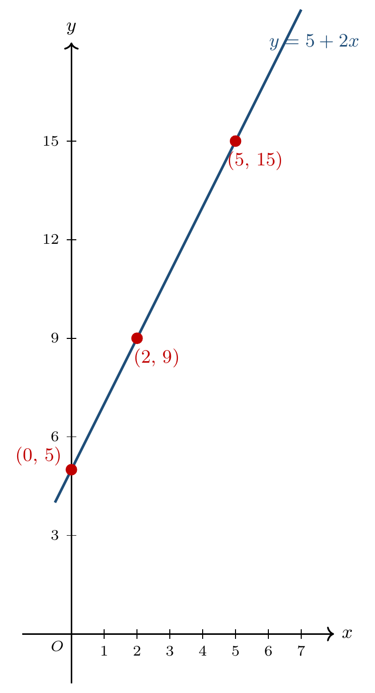

# CAPÍTULO 3 — EQUAÇÃO LINEAR E RETA NO PLANO CARTESIANO

## INTRODUÇÃO

No século XVII, o matemático e filósofo francês René Descartes uniu duas áreas que até então andavam separadas: álgebra e geometria. A obra *La Géométrie* (1637) mostrou que cada par ordenado pode ser visto como um ponto no plano — e que uma equação linear, antes apenas uma fórmula, ganha forma de reta quando suas soluções são desenhadas.

> 💭 **Pense um pouco:**  
> Dá para prever um preço olhando apenas para uma reta?

---

## 1. Do Par Ordenado ao Plano

O plano cartesiano é o palco onde uma equação linear ganha imagem.

### 1.1 Revisão do plano cartesiano

O plano cartesiano tem dois eixos perpendiculares — o horizontal $$x$$ e o vertical $$y$$ — que se cruzam na origem $$(0, 0)$$.

Veja só:

Cada ponto do plano é localizado por um par ordenado $$(x, y)$$, em que $$x$$ é o deslocamento horizontal e $$y$$ é o deslocamento vertical a partir da origem.

### 1.2 Coordenadas e quadrantes

Os dois eixos dividem o plano em quatro regiões chamadas quadrantes.

Veja o exemplo abaixo.

- 1º quadrante: $$x > 0$$ e $$y > 0$$.
- 2º quadrante: $$x < 0$$ e $$y > 0$$.
- 3º quadrante: $$x < 0$$ e $$y < 0$$.
- 4º quadrante: $$x > 0$$ e $$y < 0$$.

Em problemas práticos como tarifa por aplicativo (em que $$x$$ é distância e $$y$$ é preço), só interessa o 1º quadrante — não há quilômetros nem reais negativos.

> 🔢 **Padrão:**  
> Qualquer ponto do plano corresponde a um único par ordenado $$(x, y)$$.

---

## 2. Da Equação para a Tabela

Antes de desenhar a reta, organiza-se uma tabela com pares-solução da equação.

### 2.1 Escolhendo valores

Com a equação na forma explícita $$y = mx + n$$, basta escolher valores de $$x$$ e calcular o $$y$$ correspondente.

Veja só:

Considere a equação $$y = 5 + 2x$$. Escolhendo $$x = 0$$:

$$y = 5 + 2 \cdot 0 = 5$$

Escolhendo $$x = 1$$:

$$y = 5 + 2 \cdot 1 = 7$$

Escolhendo $$x = 2$$:

$$y = 5 + 2 \cdot 2 = 9$$

### 2.2 Calculando pares-solução

Os pares calculados formam uma tabela.

Veja o exemplo abaixo.

| $$x$$ | $$y$$ | par |
|---:|---:|---|
| 0 | 5 | $$(0, 5)$$ |
| 1 | 7 | $$(1, 7)$$ |
| 2 | 9 | $$(2, 9)$$ |
| 5 | 15 | $$(5, 15)$$ |
| 10 | 25 | $$(10, 25)$$ |

Cada linha da tabela é uma solução particular da equação $$y = 5 + 2x$$.

---

## 3. Da Tabela para a Reta

Quando os pares-solução são marcados no plano, eles aparecem alinhados — formando uma reta.

### 3.1 Marcando pontos

Cada par da tabela vira um ponto no plano cartesiano.

Veja só:

Para marcar o par $$(2, 9)$$: andar 2 à direita a partir da origem e depois 9 para cima. Esse é o ponto correspondente.

O mesmo procedimento vale para os outros pares: $$(0, 5)$$, $$(1, 7)$$, $$(5, 15)$$ e assim por diante.

### 3.2 Traçando a reta

Quando os pontos de uma equação linear são plotados, eles ficam todos sobre uma mesma linha reta.

Veja o exemplo abaixo.

Marcando $$(0, 5)$$, $$(2, 9)$$ e $$(5, 15)$$ no plano e ligando-os, aparece a reta da equação $$y = 5 + 2x$$.

A reta representa **todos** os pares-solução da equação — não apenas os 3 marcados, mas os infinitos outros que existem.

---

## 4. Interpretando a Reta

A reta no plano e a equação na forma algébrica são duas linguagens para a mesma relação.

### 4.1 Ponto sobre a reta, ponto fora da reta

Um ponto pertence à reta quando o par ordenado correspondente é solução da equação.

Veja só:

O ponto $$(3, 11)$$ pertence à reta de $$y = 5 + 2x$$? Substituindo:

$$5 + 2 \cdot 3 = 5 + 6 = 11$$

Sim — $$(3, 11)$$ está sobre a reta.

E o ponto $$(3, 15)$$? Substituindo:

$$5 + 2 \cdot 3 = 11 \neq 15$$

Não — esse ponto está fora da reta (acima dela).

### 4.2 Inclinação como leitura intuitiva

A inclinação de uma reta diz, intuitivamente, quanto o $$y$$ varia quando o $$x$$ aumenta de 1.

Veja o exemplo abaixo.

Em $$y = 5 + 2x$$, cada vez que $$x$$ aumenta 1, $$y$$ aumenta 2 — a reta sobe. Isso pode ser visto na tabela: de $$(0, 5)$$ para $$(1, 7)$$, $$y$$ subiu 2; de $$(1, 7)$$ para $$(2, 9)$$, subiu 2 de novo.

Em $$y = 10 - 3x$$, cada vez que $$x$$ aumenta 1, $$y$$ diminui 3 — a reta desce.

Em $$y = 4$$ (sem $$x$$), o $$y$$ não muda quando $$x$$ varia — a reta é horizontal.

> ⚠️ **Atenção:**  
> Equação e reta precisam dizer a mesma coisa — uma boa leitura confere os dois antes de tirar conclusões.

---

## NA VIDA REAL

Em uma corrida por aplicativo, o preço final segue uma equação parecida com $$y = 5 + 2x$$ — taxa fixa de R$ 5,00 mais R$ 2,00 por quilômetro; o gráfico permite estimar o preço de qualquer distância sem fazer a conta cada vez.

---

## E A BÍBLIA NISSO?

*"Tornai-vos, pois, praticantes da palavra e não somente ouvintes, enganando-vos a vós mesmos."* — **Tiago 1:22**

A equação escrita e a reta desenhada precisam representar a mesma verdade matemática — coerência aparece quando duas representações confirmam a mesma relação.

> 💬 **Para Conversar:** Em que momentos você diz uma coisa e faz outra — e quem percebe a incoerência primeiro?

---

## Simplificando

Uma equação linear pode ser escrita na forma $$y = mx + n$$ e representada como uma reta no plano cartesiano; cada ponto da reta corresponde a um par-solução, e a inclinação descreve, intuitivamente, quanto a reta sobe ou desce conforme $$x$$ aumenta.

---

## Fórmulas do capítulo

- **Equação linear com duas incógnitas (forma padrão):** $$ax + by = c$$.
- **Forma explícita** (com $$y$$ isolado): $$y = mx + n$$.
- **Conversão da forma padrão para a explícita:** $$y = \frac{-a}{b}x + \frac{c}{b}$$, com $$b \neq 0$$.
- **Construção da reta:** escolher valores de $$x$$, calcular $$y = mx + n$$, marcar os pares no plano e traçar a reta que passa pelos pontos.
