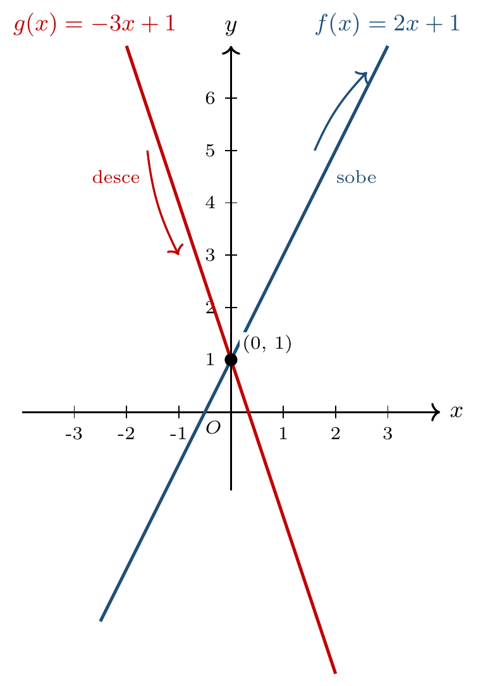

# CAPÍTULO 2 — COEFICIENTES E COMPORTAMENTO

## INTRODUÇÃO

No século XVII, o matemático francês Pierre de Fermat ajudou a fundar a geometria analítica — mostrando que cada equação algébrica corresponde a um lugar geométrico no plano. Em uma função afim, dois números — $$a$$ e $$b$$ — controlam por inteiro a forma e a posição da reta. Conhecê-los é prever o gráfico antes de desenhá-lo.

> 💭 **Pense um pouco:**  
> É melhor receber salário maior fixo ou maior porcentagem de comissão sobre as vendas?

---

## 1. O Coeficiente Angular

O coeficiente $$a$$ controla a inclinação e o sentido da reta.

### 1.1 A inclinação da reta

A inclinação é a leitura visual da subida ou descida da reta. Numericamente, $$a$$ é a *taxa de variação* — quanto $$f(x)$$ muda para cada unidade que $$x$$ aumenta.

Veja só:

Em $$f(x) = 2x + 3$$, a cada aumento de 1 unidade em $$x$$, $$f(x)$$ aumenta 2 unidades — porque $$a = 2$$.

Em $$f(x) = -3x + 1$$, a cada aumento de 1 unidade em $$x$$, $$f(x)$$ diminui 3 unidades — porque $$a = -3$$.

Quanto maior o valor absoluto de $$a$$, mais íngreme é a reta.

### 1.2 Quanto $$y$$ muda quando $$x$$ aumenta

A taxa de variação pode ser obtida diretamente a partir de dois pontos quaisquer da reta.

Veja o exemplo abaixo.

Sejam $$(x_1, y_1)$$ e $$(x_2, y_2)$$ dois pontos do gráfico, com $$x_1 \neq x_2$$. A taxa de variação é:

$$a = \frac{y_2 - y_1}{x_2 - x_1}$$

Aplicando aos pontos $$(1, 5)$$ e $$(3, 11)$$:

$$a = \frac{11 - 5}{3 - 1} = \frac{6}{2} = 3$$

A taxa de variação é 3 — para cada unidade que $$x$$ aumenta, $$f(x)$$ aumenta 3.

> 🔢 **Padrão:**  
> $$a > 0$$ → reta sobe; $$a < 0$$ → reta desce; $$|a|$$ maior → inclinação mais íngreme.

---

## 2. Crescente e Decrescente

O sinal do coeficiente $$a$$ define se a função é crescente ou decrescente.

### 2.1 Quando $$a > 0$$

Quando $$a$$ é positivo, à medida que $$x$$ aumenta, $$f(x)$$ também aumenta — a função é **crescente**.

Veja só:

Em $$f(x) = 2x + 1$$ (com $$a = 2 > 0$$):

| $$x$$ | $$f(x)$$ |
|---:|---:|
| 0 | 1 |
| 1 | 3 |
| 2 | 5 |
| 3 | 7 |

Os valores de $$f(x)$$ aumentam à medida que $$x$$ aumenta — função crescente.

### 2.2 Quando $$a < 0$$

Quando $$a$$ é negativo, à medida que $$x$$ aumenta, $$f(x)$$ diminui — a função é **decrescente**.

Veja o exemplo abaixo.

Em $$g(x) = -3x + 1$$ (com $$a = -3 < 0$$):

| $$x$$ | $$g(x)$$ |
|---:|---:|
| 0 | 1 |
| 1 | -2 |
| 2 | -5 |
| 3 | -8 |

Os valores de $$g(x)$$ diminuem à medida que $$x$$ aumenta — função decrescente.

---

## 3. O Coeficiente Linear

O coeficiente $$b$$ controla o ponto em que a reta cruza o eixo $$y$$.

### 3.1 O ponto $$(0, b)$$

Substituindo $$x = 0$$ em $$f(x) = ax + b$$:

$$f(0) = a \cdot 0 + b = b$$

Logo, todo gráfico de função afim passa pelo ponto $$(0, b)$$ — chamado *intercepto no eixo $$y$$*.

Veja só:

Em $$f(x) = 2x + 3$$, $$b = 3$$ — a reta cruza o eixo $$y$$ no ponto $$(0, 3)$$.

Em $$f(x) = -x - 4$$, $$b = -4$$ — a reta cruza o eixo $$y$$ no ponto $$(0, -4)$$.

### 3.2 Como $$b$$ desloca a reta

Mudar $$b$$ desloca a reta verticalmente, sem alterar a inclinação.

Veja o exemplo abaixo.

Comparando três funções de mesmo $$a = 2$$ e $$b$$ diferente:

- $$f(x) = 2x$$ → cruza o eixo $$y$$ em $$(0, 0)$$.
- $$g(x) = 2x + 3$$ → cruza em $$(0, 3)$$.
- $$h(x) = 2x - 5$$ → cruza em $$(0, -5)$$.

Todas têm a mesma inclinação (mesmo $$a$$), mas estão em alturas diferentes — formam retas paralelas no plano.

---

## 4. Taxa de Variação

A taxa de variação é a forma quantitativa de descrever quanto a função muda — e em problemas reais ela traz uma unidade física.

### 4.1 Calculando $$a$$ por dois pontos

A fórmula da taxa de variação a partir de dois pontos é:

$$a = \frac{f(x_2) - f(x_1)}{x_2 - x_1}$$

Veja só:

Sejam dois pontos do gráfico de uma função afim: $$(2, 7)$$ e $$(5, 16)$$. A taxa de variação é:

$$a = \frac{16 - 7}{5 - 2} = \frac{9}{3} = 3$$

### 4.2 Interpretando a unidade da taxa

Em problemas reais, a taxa $$a$$ traz a unidade de medida do contexto.

Veja o exemplo abaixo.

Considere dois vendedores com salário composto por parte fixa e comissão sobre as vendas:

- Carlos: $$C(x) = 0{,}05x + 1200$$.
- Mariana: $$M(x) = 0{,}10x + 800$$.

Aqui, $$x$$ é o valor em reais vendido no mês.

Para Carlos: parte fixa $$R\$ 1.200{,}00$$; taxa $$0{,}05$$ — significa $$5\%$$ do valor vendido.

Para Mariana: parte fixa $$R\$ 800{,}00$$; taxa $$0{,}10$$ — significa $$10\%$$ do valor vendido.

Calculando o salário das duas para vendas de $$R\$ 8.000{,}00$$:

$$C(8000) = 0{,}05 \cdot 8000 + 1200 = 400 + 1200 = 1600$$

$$M(8000) = 0{,}10 \cdot 8000 + 800 = 800 + 800 = 1600$$

Para esse valor de vendas, os dois recebem o mesmo. Mas para vendas maiores, a taxa mais alta de Mariana faz o salário dela crescer mais rápido; para vendas menores, o salário fixo mais alto de Carlos garante mais.

> ⚠️ **Atenção:**  
> $$a$$ não é apenas um número — em cada problema, ele tem unidade (R$ por GB, °F por °C, km por hora) e essa unidade é parte da interpretação.

---

## NA VIDA REAL

A diferença entre dois planos (de telefonia, de internet, de salário com comissão) costuma estar nos coeficientes — quem oferece mais parte fixa, quem oferece taxa maior. Ler $$a$$ e $$b$$ permite escolher conscientemente, não pela aparência da propaganda.

---

## E A BÍBLIA NISSO?

*"Quem anda em integridade anda seguro, mas o que perverte os seus caminhos será conhecido."* — **Provérbios 10:9**

Em uma reta, a taxa de variação é constante — a mesma inclinação do início ao fim. Quem anda com integridade caminha com a mesma inclinação de princípios, em qualquer parte do percurso.

> 💬 **Para Conversar:** Sua postura muda muito quando muda o ambiente, ou sua inclinação continua a mesma?

---

## Simplificando

Em $$f(x) = ax + b$$, o coeficiente angular $$a$$ define a inclinação e o sentido da reta ($$a > 0$$ crescente, $$a < 0$$ decrescente); o coeficiente linear $$b$$ é o valor de $$f(0)$$ e desloca a reta verticalmente; a taxa de variação pode ser calculada por dois pontos.

---

## Fórmulas do capítulo

- **Função afim:** $$f(x) = ax + b$$, com $$a \neq 0$$.
- **Intercepto no eixo $$y$$:** $$f(0) = b$$.
- **Taxa de variação por dois pontos:** $$a = \dfrac{f(x_2) - f(x_1)}{x_2 - x_1}$$, com $$x_1 \neq x_2$$.
- **Sinal do coeficiente angular:** $$a > 0$$ → função crescente; $$a < 0$$ → função decrescente.
